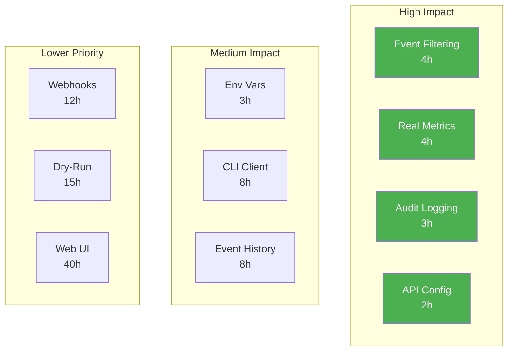

<!-- SPDX-License-Identifier: LGPL-3.0-or-later -->

# Quick Wins - High Impact, Low Effort Enhancements

These enhancements provide significant value with minimal implementation effort.

## 🎯 Top 5 Quick Wins (2-4 hours each)

### 1. Wire Event Filtering (4 hours)

**Impact:** Enable a fully-implemented feature that's currently unused

**Why Quick:** Code already exists in `src/filters/mod.rs`

**What to do:**
```diff
// src/config/mod.rs
pub struct Config {
    pub system: SystemConfig,
    pub monitoring: MonitoringConfig,
    pub routing: RoutingConfig,
    pub backends: BackendsConfig,
+   pub filters: Vec<FilterConfig>,  // Add this
}
```

```diff
// src/main.rs
let config = load_config()?;
+ let filters = config.filters.clone();

// Pass to listeners
- spawn_listener(state.clone(), config.clone()).await?;
+ spawn_listener(state.clone(), config.clone(), filters.clone()).await?;
```

**Benefit:** Users can filter which events trigger scripts

---

### 2. Enable Real Metrics (4 hours)

**Impact:** Make Prometheus monitoring actually work

**Why Quick:** Metrics struct exists, just needs incrementing

**What to do:**
```rust
// src/main.rs
let metrics = Arc::new(Metrics::new());

// In event handlers:
metrics.increment_event("address", "eth0", "systemd-networkd");

// In script executor:
let start = Instant::now();
execute_script()?;
metrics.record_script_duration(script_name, start.elapsed());
```

**Files to update:**
- `src/network/watcher.rs` - Increment event counters
- `src/system/execute.rs` - Track script execution
- `src/api/handlers.rs` - Fix `/metrics` endpoint

**Benefit:** Real monitoring with Prometheus/Grafana

---

### 3. Activate Audit Logging (3 hours)

**Impact:** Compliance and debugging

**Why Quick:** Logger code exists, just needs calling

**What to do:**
```rust
// src/main.rs
let audit_logger = Arc::new(AuditLogger::new("/var/log/netevd/audit.log")?);

// In API handlers:
audit_logger.log_api_request(method, path, status);

// In script executor:
audit_logger.log_script_execution(script, exit_code, duration);

// In event handlers:
audit_logger.log_network_event(event_type, interface, action);
```

**Benefit:** Full audit trail for troubleshooting and compliance

---

### 4. Add API Configuration (2 hours)

**Impact:** Make API customizable

**Why Quick:** Simple config struct addition

**What to do:**
```yaml
# Add to examples/netevd.yaml
api:
  enabled: true
  bind_address: "0.0.0.0"
  port: 9090
```

```rust
// src/config/mod.rs
#[derive(Deserialize)]
pub struct ApiConfig {
    pub enabled: bool,
    pub bind_address: String,
    pub port: u16,
}

// src/api/server.rs
pub async fn start_server(config: ApiConfig, state: AppState) {
    let addr = format!("{}:{}", config.bind_address, config.port);
    // ...
}
```

**Benefit:** Users can configure API binding and port

---

### 5. Environment Variable Overrides (3 hours)

**Impact:** Easier container deployment

**Why Quick:** Standard pattern in Rust

**What to do:**
```rust
// src/config/mod.rs
impl Config {
    pub fn load_with_overrides(path: &Path) -> Result<Self> {
        let mut config = Self::load(path)?;

        // Override from environment
        if let Ok(level) = env::var("NETEVD_LOG_LEVEL") {
            config.system.log_level = level;
        }
        if let Ok(backend) = env::var("NETEVD_BACKEND") {
            config.system.backend = backend;
        }

        Ok(config)
    }
}
```

**Benefit:** 12-factor app compliance, easier Docker/K8s deployment

---

## 🚀 Medium Effort, High Impact (6-8 hours each)

### 6. Complete API Status Endpoint (6 hours)

**Current:**
```json
{
  "uptime_seconds": 0,  // Always 0!
  "events_processed": 0  // Always 0!
}
```

**Fix:**
```rust
// src/main.rs
struct DaemonState {
    start_time: Instant,
    event_counter: Arc<AtomicU64>,
}

// In event loop:
state.event_counter.fetch_add(1, Ordering::Relaxed);

// In API handler:
{
  "uptime_seconds": state.start_time.elapsed().as_secs(),
  "events_processed": state.event_counter.load(Ordering::Relaxed)
}
```

---

### 7. Implement CLI HTTP Client (8 hours)

**Impact:** Make `netevd status/list/show` commands work

**What to do:**
```rust
// Cargo.toml
[dependencies]
reqwest = { version = "0.11", features = ["json"] }

// src/cli/handler.rs
async fn get_status(endpoint: &str) -> Result<Status> {
    let url = format!("{}/api/v1/status", endpoint);
    let response = reqwest::get(&url).await?;
    Ok(response.json().await?)
}
```

**Files:**
- Add HTTP client calls for all 8 stub functions
- Add error handling
- Add timeout configuration
- Format output nicely

---

### 8. Event History Storage (8 hours)

**Impact:** Make `/api/v1/events` endpoint useful

**What to do:**
```rust
// src/events/history.rs (new file)
pub struct EventHistory {
    events: VecDeque<Event>,
    max_size: usize,
}

impl EventHistory {
    pub fn push(&mut self, event: Event) {
        if self.events.len() >= self.max_size {
            self.events.pop_front();
        }
        self.events.push_back(event);
    }

    pub fn query(&self, filter: EventFilter) -> Vec<Event> {
        self.events.iter()
            .filter(|e| filter.matches(e))
            .cloned()
            .collect()
    }
}
```

**Benefit:** Query recent network events via API/CLI

---

## 💡 Feature Ideas (10-20 hours each)

### 9. Script Output Capture

**Use Case:** Debug failing scripts

```rust
// Capture stdout/stderr from scripts
let output = Command::new(&script)
    .output()?;

audit_logger.log_script_output(script, output.stdout, output.stderr);
```

**Benefit:** See why scripts fail

---

### 10. Webhook Notifications

**Use Case:** Alert external systems

```yaml
webhooks:
  - url: https://slack.com/webhooks/...
    events: [link_down, route_change]

  - url: https://alerts.example.com/notify
    events: [interface_error]
```

**Benefit:** Integrate with alerting systems without scripts

---

### 11. Configuration Validation Endpoint

**Use Case:** Test config before applying

```bash
curl -X POST http://localhost:9090/api/v1/config/validate \
  -H "Content-Type: application/yaml" \
  --data-binary @new-config.yaml
```

**Response:**
```json
{
  "valid": false,
  "errors": [
    "Invalid log_level 'verbose' at line 3",
    "Interface 'eth99' not found"
  ]
}
```

---

### 12. Dry-Run Mode API

**Use Case:** Preview changes before applying

```bash
curl -X POST http://localhost:9090/api/v1/dry-run \
  -H "Content-Type: application/yaml" \
  --data-binary @config.yaml
```

**Response:**
```json
{
  "changes": [
    "Would create routing rule: from 192.168.1.100 table 203",
    "Would execute script: /etc/netevd/routable.d/01-notify.sh"
  ]
}
```

---

## 🏗️ Infrastructure Improvements

### 13. GitHub Actions Workflow

**Add CI job for:**
- Clippy lints
- Format checking
- Security audit
- Benchmark tracking
- Documentation building

---

### 14. Docker Compose Example

```yaml
version: '3.8'
services:
  netevd:
    image: netevd:latest
    network_mode: host
    cap_add:
      - NET_ADMIN
    volumes:
      - ./netevd.yaml:/etc/netevd/netevd.yaml
      - ./scripts:/etc/netevd/routable.d
    environment:
      - NETEVD_LOG_LEVEL=debug

  prometheus:
    image: prom/prometheus
    ports:
      - "9090:9090"
    volumes:
      - ./prometheus.yml:/etc/prometheus/prometheus.yml

  grafana:
    image: grafana/grafana
    ports:
      - "3000:3000"
```

---

### 15. Helm Chart

**For Kubernetes deployment:**
```
netevd/
├── Chart.yaml
├── values.yaml
├── templates/
│   ├── daemonset.yaml
│   ├── configmap.yaml
│   ├── service.yaml
│   └── servicemonitor.yaml
```

---

## 📊 Testing Improvements

### 16. API Integration Tests

```rust
#[tokio::test]
async fn test_status_endpoint() {
    let server = spawn_test_server().await;

    let response = reqwest::get(&format!("{}/api/v1/status", server.url()))
        .await
        .unwrap();

    assert_eq!(response.status(), 200);

    let status: Status = response.json().await.unwrap();
    assert!(status.uptime_seconds > 0);
}
```

---

### 17. CLI Integration Tests

```rust
#[test]
fn test_cli_status_command() {
    let output = Command::new("netevd")
        .arg("status")
        .arg("--format=json")
        .output()
        .unwrap();

    assert!(output.status.success());

    let status: Value = serde_json::from_slice(&output.stdout).unwrap();
    assert!(status["uptime_seconds"].as_u64().unwrap() > 0);
}
```

---

### 18. Performance Benchmarks

```rust
#[bench]
fn bench_event_processing(b: &mut Bencher) {
    b.iter(|| {
        process_address_event(test_event());
    });
}

// Target: <1ms per event
```

---

## 🎓 Documentation Enhancements

### 19. Video Tutorials

**Topics:**
- Quick start (5 min)
- Multi-interface routing (10 min)
- VPN integration (15 min)
- Monitoring with Prometheus (10 min)
- Kubernetes deployment (12 min)

**Platform:** YouTube channel

---

### 20. Interactive Config Generator

**Web tool:**
```
https://netevd.io/config-generator

[x] systemd-networkd
[ ] NetworkManager
[ ] dhclient

Interfaces to monitor: [eth0] [eth1] [+ Add]

[ ] Enable routing policy rules
[x] Enable API (Port: 9090)
[x] Enable metrics

[Generate Config] [Download] [Copy to Clipboard]
```

---

## 🔄 Recommended Implementation Order

1. **Sprint 1 (Week 1):** Quick Wins #1-5 (15 hours)
2. **Sprint 2 (Week 2):** Medium Effort #6-8 (22 hours)
3. **Sprint 3 (Week 3):** Feature Ideas #9-12 (40 hours)
4. **Sprint 4 (Week 4):** Infrastructure & Testing #13-18
5. **Sprint 5 (Week 5+):** Documentation & Community

---

## 📈 Impact vs Effort Matrix



**Start with green boxes** - Best ROI!

---

Ready to implement? Pick any enhancement and refer to the ROADMAP.md for detailed specifications.
