# netevd - Network Event Daemon

[](https://www.gnu.org/licenses/lgpl-3.0)

A high-performance network event daemon written in Rust that configures network interfaces and executes scripts on network events from systemd-networkd, NetworkManager DBus signals, or when dhclient gains a lease. It also monitors:

1. Address changes (added/removed/modified)
2. Link changes (added/removed)
3. Route modifications

## ✨ Features

### Core Features
- 🚀 **Async/Await Architecture**: Built on tokio for efficient event handling
- 🔌 **Multiple Network Managers**: Supports systemd-networkd, NetworkManager, and dhclient
- 🛣️ **Routing Policy Rules**: Automatically configures multi-interface routing with custom routing tables
- 📜 **Script Execution**: Executes user-defined scripts on network state changes
- 🔒 **Security**: Runs as unprivileged user with minimal capabilities (CAP_NET_ADMIN only)
- ⚡ **Real-time Monitoring**: Sub-100ms event latency via netlink multicast
- 🎯 **Input Validation**: Defense-in-depth against command injection
- 🔄 **Atomic State Updates**: Race-free network state management

### New in v0.2.0 🎉

#### Developer Tools
- 🖥️ **Enhanced CLI**: Comprehensive command-line interface with `status`, `list`, `show`, `events`, `reload`, `validate`, and `test` commands
- ✅ **Config Validation**: Built-in YAML configuration validation tool
- 🧪 **Dry-run Mode**: Test configuration changes safely without applying them
- 📊 **Multiple Output Formats**: JSON, YAML, and table formats for all commands

#### Enterprise Features
- 🌐 **REST API**: Full-featured HTTP API built with Axum framework (9 endpoints)
- 🔍 **Event Filtering**: Advanced event filtering with pattern matching and conditional expressions
- 📈 **Prometheus Metrics**: 15+ metrics across 6 categories for comprehensive monitoring
- 📝 **Audit Logging**: Structured JSON audit logs for compliance and debugging
- 🌍 **IPv6 Support**: Policy routing for IPv6 with RFC 6724 address selection
- 🎨 **Web Dashboard**: Real-time monitoring interface with auto-refresh

#### Cloud & Kubernetes
- ☸️ **Kubernetes Operator**: Custom Resource Definitions and DaemonSet deployment
- 🐳 **Docker Images**: Debian (~150MB) and Alpine (~50MB) container images
- ☁️ **Cloud Provider Integration**: AWS EC2, Azure, and GCP API integrations
- 📦 **Multiple Distribution Formats**: Available on crates.io, with RPM, DEB, and AUR packages

## 📊 Architecture Overview

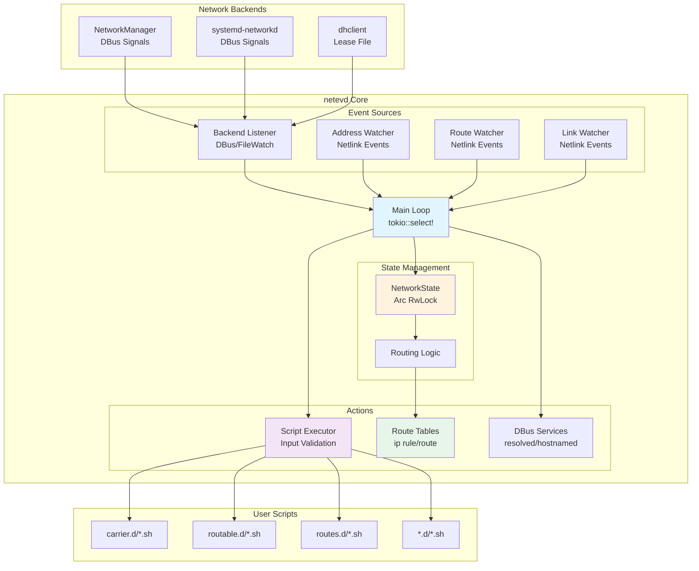

## 🔄 Event Flow

### systemd-networkd Backend

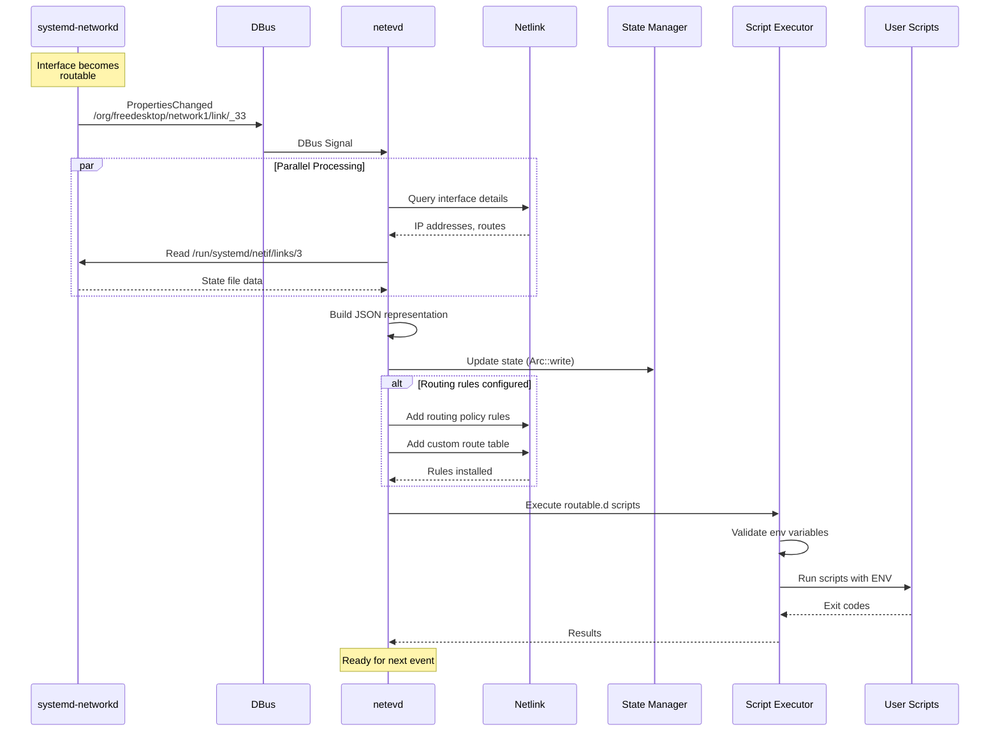

### Real-time Netlink Events

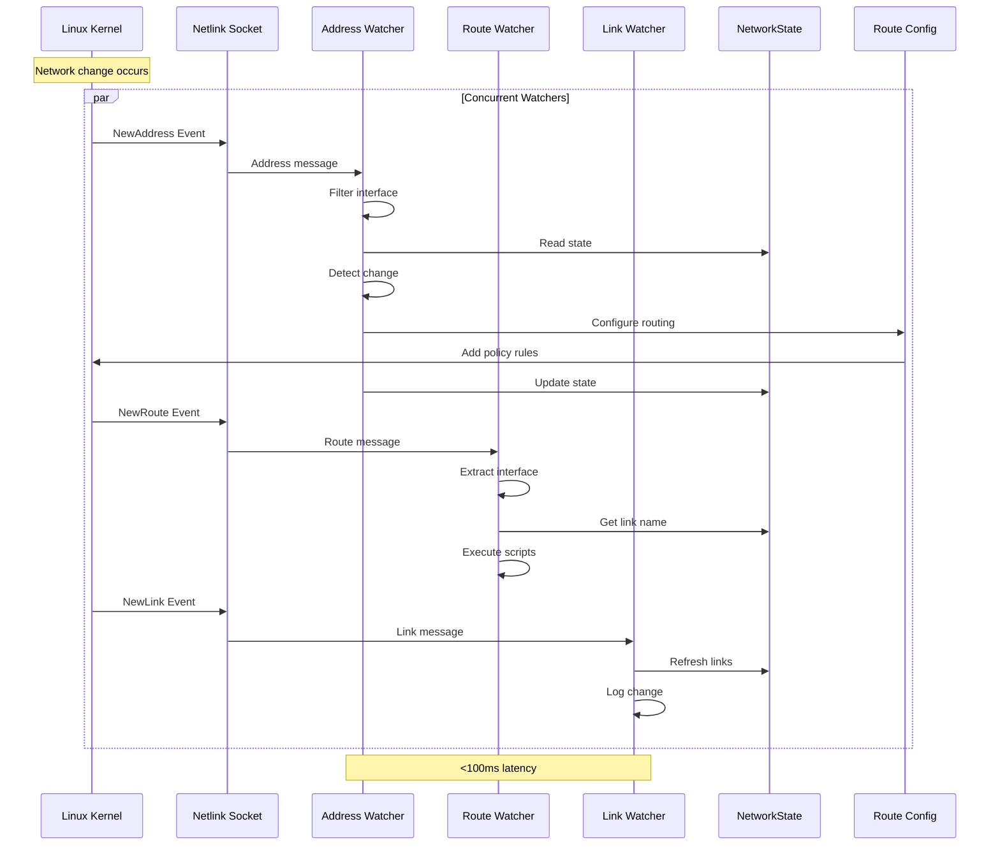

## 🛣️ Routing Policy Rules Flow

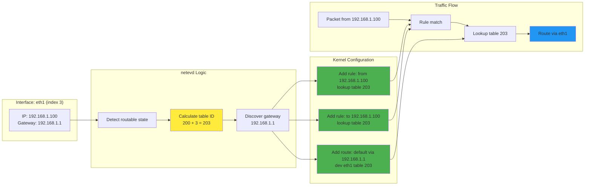

## 🔐 Security Model

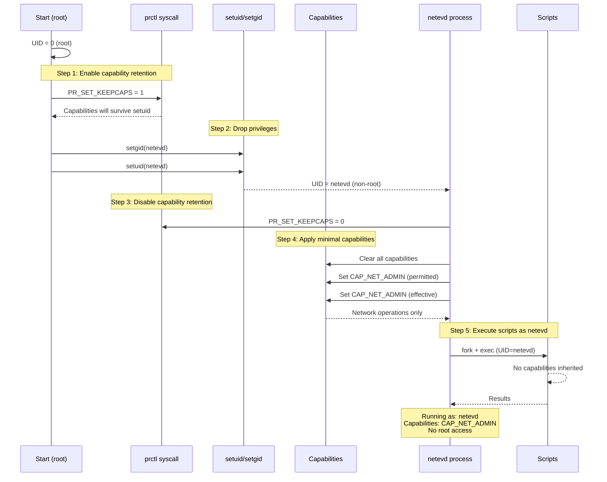

## 📡 Component Interaction

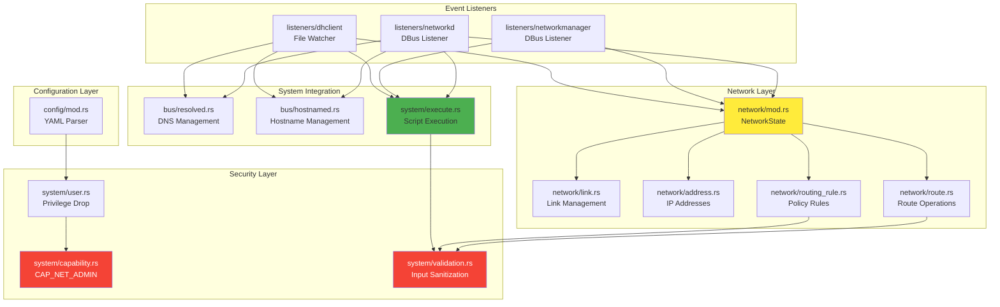

## 🔀 Network State Machine

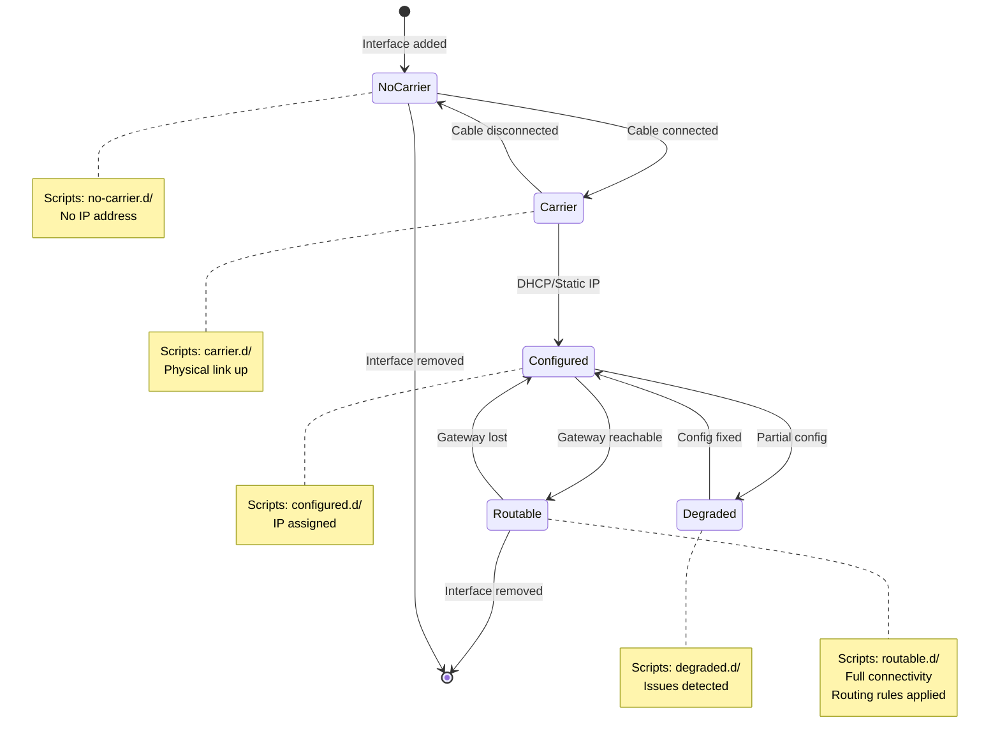

## 📦 Deployment Architecture

```mermaid
graph TB
    subgraph "System Boot"
        SYS[systemd]
    end

    subgraph "netevd Service"
        BIN["Binary: /usr/bin/netevd"]
        CFG["Config: /etc/netevd/netevd.yaml"]
        USR["User: netevd"]
        CAP["Capabilities: CAP_NET_ADMIN"]
    end

    subgraph "User Scripts"
        SC1["carrier.d/"]
        SC2["routable.d/"]
        SC3["routes.d/"]
        SC4["activated.d/"]
    end

    subgraph "System Services"
        NWD[systemd-networkd]
        RES[systemd-resolved]
        HST[systemd-hostnamed]
        NMG[NetworkManager]
    end

    subgraph "Kernel"
        NET[Netlink Socket]
        RTB[Routing Tables]
        RUL[Policy Rules]
    end

    SYS -->|Starts| BIN
    BIN -->|Reads| CFG
    BIN -->|Runs as| USR
    BIN -->|Requires| CAP

    BIN <-->|DBus| NWD
    BIN <-->|DBus| NMG
    BIN <-->|DBus| RES
    BIN <-->|DBus| HST

    BIN <-->|Subscribe| NET
    BIN -->|Configure| RTB
    BIN -->|Configure| RUL

    BIN -->|Execute| SC1
    BIN -->|Execute| SC2
    BIN -->|Execute| SC3
    BIN -->|Execute| SC4

    style BIN fill:#2196f3,color:#fff
    style USR fill:#4caf50,color:#fff
    style CAP fill:#ff9800,color:#fff
    style NET fill:#9c27b0,color:#fff
```

## 📋 Table of Contents

- [Quick Start](#quick-start)
- [Use Cases & Examples](#use-cases--examples)
- [Configuration](#configuration)
- [Advanced Usage](#advanced-usage)
- [Building from Source](#building-from-source)
- [Troubleshooting](#troubleshooting)

## Quick Start

### Installation

```bash
# Clone the repository
git clone https://github.com/ssahani/netevd.git
cd netevd

# Build and install
cargo build --release
sudo install -Dm755 target/release/netevd /usr/bin/netevd
sudo install -Dm644 systemd/netevd.service /lib/systemd/system/netevd.service
sudo install -Dm644 examples/netevd.yaml /etc/netevd/netevd.yaml

# Create script directories
sudo mkdir -p /etc/netevd/{carrier.d,configured.d,degraded.d,manager.d,no-carrier.d,routable.d,routes.d,activated.d,disconnected.d}

# Create netevd user
sudo useradd -M -s /usr/bin/nologin netevd

# Enable and start service
sudo systemctl daemon-reload
sudo systemctl enable --now netevd
```

### Basic Configuration

Edit `/etc/netevd/netevd.yaml`:

```yaml
system:
  log_level: "info"
  backend: "systemd-networkd"  # or "NetworkManager" or "dhclient"

network:
  links: "eth0 eth1"  # Interfaces to monitor
  routing_policy_rules: "eth1"  # Interfaces needing custom routing
  emit_json: true
  use_dns: false
  use_domain: false
  use_hostname: false
```

## Use Cases & Examples

### Example 1: Run a Command When DHCP Address is Acquired

#### With systemd-networkd

Create an executable script `/etc/netevd/routable.d/01-notify.sh`:

```bash
#!/bin/bash
# This script runs when an interface becomes routable

# Available environment variables:
# - LINK: Interface name (e.g., "eth0")
# - LINKINDEX: Interface index number
# - STATE: Current state ("routable")
# - BACKEND: Event source ("systemd-networkd")
# - ADDRESSES: Space-separated list of IP addresses
# - JSON: Full interface information in JSON format

echo "Interface $LINK ($LINKINDEX) is now routable"
echo "IP Addresses: $ADDRESSES"

# Example: Send notification
notify-send "Network Ready" "Interface $LINK is now routable with IPs: $ADDRESSES"

# Example: Start a service that depends on network
systemctl start myapp.service

# Example: Update DNS configuration
echo "nameserver $DNS" >> /etc/resolv.conf.d/custom
```

Make it executable:
```bash
sudo chmod +x /etc/netevd/routable.d/01-notify.sh
```

#### With NetworkManager

Create `/etc/netevd/activated.d/01-network-ready.sh`:

```bash
#!/bin/bash
# Runs when NetworkManager activates an interface

logger -t netevd "Interface $LINK activated with state: $STATE"

if [ "$STATE" = "activated" ]; then
    # Your custom logic here
    /usr/local/bin/update-vpn-routes.sh "$LINK"
fi
```

#### With dhclient

Configure dhclient mode in `/etc/netevd/netevd.yaml`:

```yaml
system:
  backend: "dhclient"

network:
  use_dns: true
  use_domain: true
  use_hostname: true
```

Create `/etc/netevd/routable.d/01-dhcp-lease.sh`:

```bash
#!/bin/bash
# Available DHCP lease variables:
# - DHCP_ADDRESS: Assigned IP address
# - DHCP_GATEWAY: Default gateway
# - DHCP_DNS: DNS servers
# - DHCP_DOMAIN: Domain name
# - DHCP_HOSTNAME: Hostname from DHCP

echo "Got DHCP lease for $LINK: $DHCP_ADDRESS"
echo "Gateway: $DHCP_GATEWAY"
echo "DNS: $DHCP_DNS"
```

### Example 2: Multi-Interface Routing (Secondary Network Interface)

**Problem**: You have two interfaces (eth0 and eth1) in the same subnet. Traffic arriving via eth1 tries to leave via eth0 (default gateway), breaking return packets.

**Solution**: Use routing policy rules to ensure traffic arriving on eth1 leaves via eth1.

#### Configuration

Edit `/etc/netevd/netevd.yaml`:

```yaml
system:
  backend: "systemd-networkd"

network:
  routing_policy_rules: "eth1"  # Configure routing for eth1
```

#### What happens automatically:

1. When eth1 gets an IP address (e.g., 192.168.1.100)
2. `netevd` creates a custom routing table (table ID = 200 + ifindex)
3. Adds routing policy rules:
   - `from 192.168.1.100 lookup 203` (assuming ifindex=3)
   - `to 192.168.1.100 lookup 203`
4. Adds default route in table 203 via eth1's gateway

#### Verify it works:

```bash
# View routing policy rules
ip rule list

# You should see:
# 32765:  from 192.168.1.100 lookup 203
# 32766:  to 192.168.1.100 lookup 203

# View custom routing table
ip route show table 203

# You should see:
# default via 192.168.1.1 dev eth1
```

#### Test connectivity:

```bash
# Send traffic from eth1's IP
curl --interface eth1 https://example.com

# Verify with tcpdump
sudo tcpdump -i eth1 -n host 192.168.1.100
```

### Example 3: Execute Custom Scripts on Link State Changes

#### Monitor carrier loss and notify

Create `/etc/netevd/no-carrier.d/01-alert.sh`:

```bash
#!/bin/bash
# Runs when interface loses carrier (cable unplugged)

ALERT_EMAIL="admin@example.com"

echo "Interface $LINK lost carrier at $(date)" | \
    mail -s "Network Alert: Link Down on $(hostname)" "$ALERT_EMAIL"

# Log to syslog
logger -t netevd -p daemon.warning "Link $LINK carrier lost"

# Could also: disable services, trigger failover, etc.
```

#### Auto-reconnect WiFi

Create `/etc/netevd/disconnected.d/01-wifi-reconnect.sh`:

```bash
#!/bin/bash
# Auto-reconnect WiFi when NetworkManager disconnects

if [ "$BACKEND" = "NetworkManager" ] && [ "$STATE" = "disconnected" ]; then
    # Wait a bit
    sleep 5

    # Try to reconnect
    nmcli device connect "$LINK"

    logger -t netevd "Attempted to reconnect $LINK"
fi
```

### Example 4: Dynamic DNS Updates

Create `/etc/netevd/routable.d/02-update-dns.sh`:

```bash
#!/bin/bash
# Update dynamic DNS when IP changes

DDNS_HOSTNAME="myhost.dyndns.org"
DDNS_TOKEN="your-api-token"

# Extract first IPv4 address
IP=$(echo "$ADDRESSES" | awk '{print $1}')

if [[ "$IP" =~ ^[0-9]+\.[0-9]+\.[0-9]+\.[0-9]+$ ]]; then
    # Update dynamic DNS (example for Cloudflare)
    curl -X PUT "https://api.cloudflare.com/client/v4/zones/ZONE_ID/dns_records/RECORD_ID" \
         -H "Authorization: Bearer $DDNS_TOKEN" \
         -H "Content-Type: application/json" \
         --data "{\"type\":\"A\",\"name\":\"$DDNS_HOSTNAME\",\"content\":\"$IP\"}"

    logger -t netevd "Updated DDNS for $LINK: $IP"
fi
```

### Example 5: JSON Processing with jq

systemd-networkd provides rich JSON data. Create `/etc/netevd/routable.d/03-process-json.sh`:

```bash
#!/bin/bash
# Process JSON data from systemd-networkd

if [ -z "$JSON" ]; then
    echo "No JSON data available"
    exit 0
fi

# Parse JSON with jq
MTU=$(echo "$JSON" | jq -r '.MTU')
DRIVER=$(echo "$JSON" | jq -r '.Driver')
IPV4_STATE=$(echo "$JSON" | jq -r '.IPv4AddressState')
DNS_SERVERS=$(echo "$JSON" | jq -r '.DNS[]' | tr '\n' ' ')

echo "Interface: $LINK"
echo "  MTU: $MTU"
echo "  Driver: $DRIVER"
echo "  IPv4 State: $IPV4_STATE"
echo "  DNS Servers: $DNS_SERVERS"

# Example: Adjust MTU if needed
if [ "$MTU" -gt 1500 ]; then
    ip link set dev "$LINK" mtu 1500
    logger -t netevd "Adjusted MTU on $LINK to 1500"
fi

# Example: Log all addresses
echo "$JSON" | jq -r '.Address[] | "  \(.IP)/\(.Mask)"'
```

### Example 6: VPN Integration

Create `/etc/netevd/routable.d/04-vpn-routes.sh`:

```bash
#!/bin/bash
# Add custom routes when VPN interface comes up

VPN_INTERFACE="wg0"
OFFICE_NETWORK="10.0.0.0/8"
REMOTE_NETWORK="172.16.0.0/12"

if [ "$LINK" = "$VPN_INTERFACE" ] && [ "$STATE" = "routable" ]; then
    # Add routes to private networks via VPN
    ip route add $OFFICE_NETWORK dev $VPN_INTERFACE
    ip route add $REMOTE_NETWORK dev $VPN_INTERFACE

    logger -t netevd "Added VPN routes for $LINK"

    # Update firewall rules
    iptables -A FORWARD -i $VPN_INTERFACE -j ACCEPT
    iptables -A FORWARD -o $VPN_INTERFACE -j ACCEPT
fi
```

## Directory Structure

`netevd` uses the following directories in `/etc/netevd/`:

```
/etc/netevd/
├── netevd.yaml              # Main configuration file
├── carrier.d/               # Link has carrier (cable connected)
├── no-carrier.d/            # Link lost carrier (cable disconnected)
├── configured.d/            # Link is configured (systemd-networkd)
├── degraded.d/              # Link is degraded (systemd-networkd)
├── routable.d/              # Link is routable (has working network)
├── activated.d/             # Device activated (NetworkManager)
├── disconnected.d/          # Device disconnected (NetworkManager)
├── manager.d/               # Network manager state changes
└── routes.d/                # Route changes detected
```

**Script Execution Rules:**
- Scripts must be executable (`chmod +x`)
- Scripts are executed in alphabetical order (prefix with numbers: `01-`, `02-`, etc.)
- Scripts receive environment variables with network state information
- Non-zero exit codes are logged but don't stop other scripts

## Configuration

### Configuration File: `/etc/netevd/netevd.yaml`

#### System Section

| Option | Values | Default | Description |
|--------|--------|---------|-------------|
| `log_level` | `trace`, `debug`, `info`, `warn`, `error` | `info` | Logging verbosity |
| `backend` | `systemd-networkd`, `NetworkManager`, `dhclient` | `systemd-networkd` | Network event source |

#### Network Section

| Option | Type | Default | Description |
|--------|------|---------|-------------|
| `links` | String | (all) | Space-separated list of interfaces to monitor |
| `routing_policy_rules` | String | (none) | Interfaces needing custom routing tables |
| `emit_json` | Boolean | `true` | Emit JSON data (systemd-networkd only) |
| `use_dns` | Boolean | `false` | Send DNS to systemd-resolved (dhclient only) |
| `use_domain` | Boolean | `false` | Send domain to systemd-resolved (dhclient only) |
| `use_hostname` | Boolean | `false` | Send hostname to systemd-hostnamed (dhclient only) |

### Complete Configuration Examples

#### Example 1: Laptop with WiFi

```yaml
system:
  log_level: "info"
  backend: "NetworkManager"

network:
  links: "wlan0"
  routing_policy_rules: ""
  emit_json: false
```

#### Example 2: Server with Multiple NICs

```yaml
system:
  log_level: "warn"
  backend: "systemd-networkd"

network:
  links: "eth0 eth1 eth2"
  routing_policy_rules: "eth1 eth2"  # eth0 is primary
  emit_json: true
```

#### Example 3: Legacy System with dhclient

```yaml
system:
  log_level: "debug"
  backend: "dhclient"

network:
  links: "eth0"
  use_dns: true
  use_domain: true
  use_hostname: true
```

## Advanced Usage

### Environment Variables Available to Scripts

#### Common Variables (All Generators)

- `LINK`: Interface name (e.g., `eth0`)
- `LINKINDEX`: Interface index number
- `STATE`: Current state (e.g., `routable`, `activated`, `disconnected`)
- `BACKEND`: Source of event (`systemd-networkd`, `NetworkManager`, `dhclient`)
- `ADDRESSES`: Space-separated list of IP addresses on the interface

#### systemd-networkd Specific

- `JSON`: Full interface data in JSON format (if `emit_json: true`)
  - Includes: MTU, MAC address, driver, operational state, DNS, routes, etc.

#### dhclient Specific

- `DHCP_ADDRESS`: IP address from DHCP lease
- `DHCP_GATEWAY`: Default gateway
- `DHCP_DNS`: DNS servers
- `DHCP_DOMAIN`: Domain name
- `DHCP_HOSTNAME`: Hostname from DHCP
- `DHCP_LEASE`: Full lease information

#### NetworkManager Specific

All common variables plus NetworkManager device state information.

### Custom Routing Tables

When `routing_policy_rules` is configured for an interface, `netevd` automatically:

1. **Calculates table ID**: `200 + interface_index`
   - eth0 (index 2) → table 202
   - eth1 (index 3) → table 203
   - wlan0 (index 4) → table 204

2. **Creates routing policy rules**:
   ```bash
   ip rule add from <interface_ip> table <table_id>
   ip rule add to <interface_ip> table <table_id>
   ```

3. **Adds default route**:
   ```bash
   ip route add default via <gateway> dev <interface> table <table_id>
   ```

4. **Cleanup**: When address is removed, rules and routes are automatically deleted

### Monitoring netevd

```bash
# Check service status
sudo systemctl status netevd

# View logs
sudo journalctl -u netevd -f

# View recent logs with context
sudo journalctl -u netevd -n 100

# Filter by priority
sudo journalctl -u netevd -p warning

# Check which scripts are being executed
sudo journalctl -u netevd | grep "Executing"
```

### Testing Scripts Manually

```bash
# Set environment variables and run script
sudo env LINK=eth0 LINKINDEX=2 STATE=routable BACKEND=systemd-networkd \
     ADDRESSES="192.168.1.100" \
     /etc/netevd/routable.d/01-test.sh

# Test with JSON data
sudo env LINK=eth0 JSON='{"Index":2,"Name":"eth0","OperState":"up"}' \
     /etc/netevd/routable.d/02-json-test.sh
```

## Building from Source

### Prerequisites

- Rust 1.70 or later
- Cargo
- Linux with systemd (for full functionality)

### Build

```bash
# Clone repository
git clone https://github.com/ssahani/netevd.git
cd netevd

# Build in release mode
cargo build --release

# Run tests
cargo test

# Check for issues
cargo clippy
```

### Installation

```bash
# Install binary
sudo install -Dm755 target/release/netevd /usr/bin/netevd

# Install systemd service
sudo install -Dm644 systemd/netevd.service /lib/systemd/system/netevd.service

# Install configuration
sudo install -Dm644 examples/netevd.yaml /etc/netevd/netevd.yaml

# Create user
sudo useradd -r -s /usr/bin/nologin -d /nonexistent netevd

# Create script directories
sudo mkdir -p /etc/netevd/{carrier.d,no-carrier.d,configured.d,degraded.d,routable.d,activated.d,disconnected.d,manager.d,routes.d}

# Enable service
sudo systemctl daemon-reload
sudo systemctl enable --now netevd
```

## Troubleshooting

### Service won't start

```bash
# Check service status
sudo systemctl status netevd

# View full logs
sudo journalctl -u netevd -n 100 --no-pager

# Common issues:
# 1. User doesn't exist
sudo useradd -r -s /usr/bin/nologin netevd

# 2. Configuration file syntax error
netevd --config /etc/netevd/netevd.yaml

# 3. Permission issues
sudo chown -R netevd:netevd /etc/netevd/
```

### Scripts not executing

```bash
# Check if scripts are executable
ls -la /etc/netevd/routable.d/

# Make scripts executable
sudo chmod +x /etc/netevd/routable.d/*.sh

# Check logs for script execution
sudo journalctl -u netevd | grep "Executing"

# Test script manually
sudo bash -x /etc/netevd/routable.d/01-test.sh
```

### Routing policy rules not working

```bash
# Check if interface is configured for routing rules
grep routing_policy_rules /etc/netevd/netevd.yaml

# View current rules
ip rule list

# View custom routing tables
ip route show table 202  # Adjust table number

# Check netevd logs
sudo journalctl -u netevd | grep "routing"
```

### No events received

```bash
# For systemd-networkd:
# Check if networkd is running
systemctl status systemd-networkd

# Trigger an event
sudo networkctl reload

# For NetworkManager:
systemctl status NetworkManager
nmcli device status

# For dhclient:
# Check if dhclient is running
ps aux | grep dhclient

# Restart dhclient to generate events
sudo systemctl restart dhclient
```

### Debug logging

```bash
# Enable debug logging
sudo sed -i 's/log_level: "info"/log_level: "debug"/' /etc/netevd/netevd.yaml
sudo systemctl restart netevd

# Or set via environment variable
sudo systemctl edit netevd

# Add:
[Service]
Environment="RUST_LOG=debug"

sudo systemctl daemon-reload
sudo systemctl restart netevd
```

## 🏗️ Technical Architecture

### Technology Stack

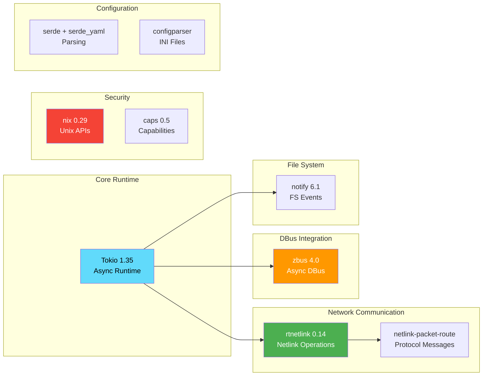

### Module Architecture

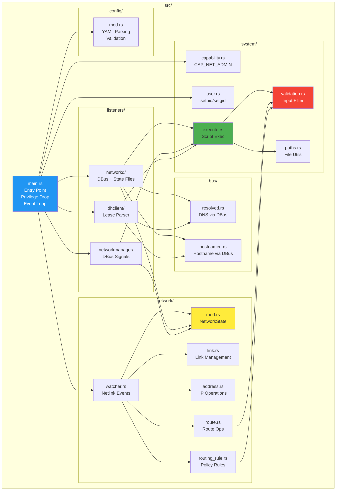

### Concurrency Model

All watchers and listeners run concurrently using `tokio::select!`:

```rust
tokio::select! {
    _ = watch_addresses() => {},      // Netlink address events
    _ = watch_routes() => {},         // Netlink route events
    _ = watch_links() => {},          // Netlink link events
    _ = spawn_listener() => {},       // DBus or file watcher
    _ = signal_handler() => {},       // SIGTERM/SIGINT
}
```

### Data Flow Pipeline

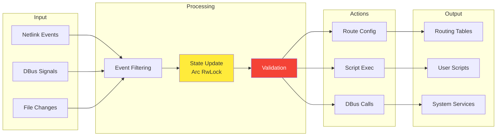

## 🔒 Security

`netevd` implements defense-in-depth security with multiple layers:

### Security Layers

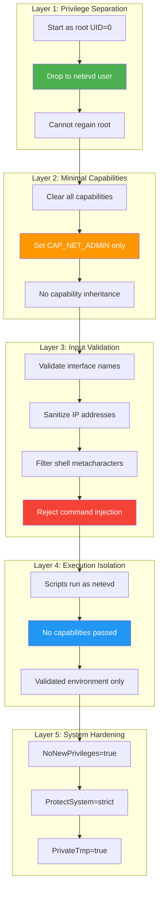

### Security Features

1. **Privilege Dropping**: Starts as root, drops to `netevd` user
2. **Minimal Capabilities**: Retains only `CAP_NET_ADMIN` (network configuration)
3. **Capability Retention**: Uses `prctl(PR_SET_KEEPCAPS)` for safe privilege drop
4. **Input Validation**: All environment variables validated before script execution
5. **Script Execution**: Scripts run as `netevd` user with no capabilities
6. **No Shell Injection**: Dangerous characters rejected (`;`, `$`, backticks, etc.)
7. **Systemd Hardening**: NoNewPrivileges, ProtectSystem, PrivateTmp

### Threat Model & Mitigations

| Threat | Mitigation |
|--------|------------|
| **Malicious DHCP Server** | Input validation rejects shell metacharacters |
| **Command Injection** | Environment variables sanitized, dangerous patterns blocked |
| **Privilege Escalation** | Runs as `netevd` user, NoNewPrivileges prevents setuid |
| **Capability Leakage** | Scripts inherit no capabilities |
| **System File Tampering** | ProtectSystem=strict, read-only filesystem |
| **Resource Exhaustion** | Systemd resource limits (optional) |

### Capability Details

```bash
# View capabilities (if using systemd)
sudo systemctl show netevd | grep Capabilit

# Should show:
# AmbientCapabilities=cap_net_admin
# CapabilityBoundingSet=cap_net_admin

# Binary capabilities (alternative to systemd)
sudo getcap /usr/bin/netevd
# /usr/bin/netevd = cap_net_admin+eip
```

### Validation Examples

```rust
// Interface names: only alphanumeric, _, -, .
validate_interface_name("eth0")       // ✅ Pass
validate_interface_name("eth0; rm")   // ❌ Reject

// IP addresses: strict parsing
validate_ip_address("192.168.1.1")    // ✅ Pass
validate_ip_address("192.168.1.1; whoami") // ❌ Reject

// Hostnames: RFC compliant
validate_hostname("example.com")      // ✅ Pass
validate_hostname("$(whoami).com")    // ❌ Reject

// Environment values: no shell metacharacters
sanitize_env_value("safe-value")      // ✅ Pass
sanitize_env_value("value && malicious") // ❌ Reject
```

## ⚡ Performance

### Benchmarks

Performance metrics on modern hardware (4-core CPU, 8GB RAM):

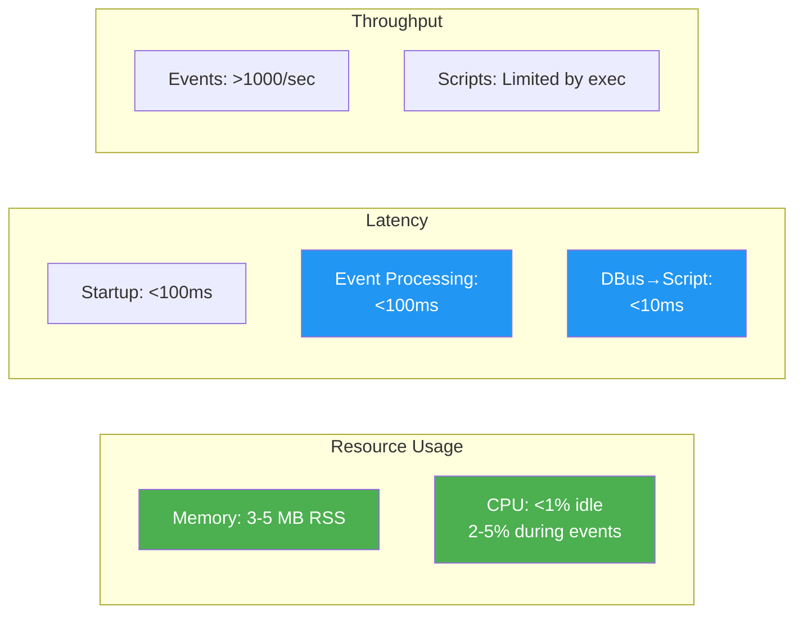

### Performance Characteristics

| Metric | Value | Notes |
|--------|-------|-------|
| **Memory (Idle)** | 3-5 MB RSS | Minimal footprint |
| **Memory (Active)** | 5-8 MB RSS | During event processing |
| **CPU (Idle)** | <1% | Async I/O, event-driven |
| **CPU (Events)** | 2-5% | Brief spikes during processing |
| **Startup Time** | <100ms | Fast boot integration |
| **Event Latency** | <100ms | Netlink multicast subscription |
| **Script Latency** | <10ms | From event to script execution |
| **Concurrent Events** | 1000+/sec | Async processing with tokio |

### Comparison vs Polling

```mermaid
gantt
    title Event Latency Comparison
    dateFormat X
    axisFormat %Ls

    section Netlink Events
    Event occurs: milestone, 0, 0
    netevd detects: milestone, 50, 50
    Script executes: milestone, 60, 60

    section Polling (5s)
    Event occurs: milestone, 0, 0
    Poll interval: 0, 5000
    netevd detects: milestone, 5000, 5000
    Script executes: milestone, 5010, 5010
```

**Result**: Real-time events are **50-100x faster** than 5-second polling

## Contributing

Contributions are welcome! Please:

1. Fork the repository
2. Create a feature branch (`git checkout -b feature/amazing-feature`)
3. Make your changes
4. Add tests if applicable
5. Run `cargo test` and `cargo clippy`
6. Commit your changes (`git commit -m 'Add amazing feature'`)
7. Push to the branch (`git push origin feature/amazing-feature`)
8. Open a Pull Request

### Development Setup

```bash
# Install development tools
rustup component add rustfmt clippy

# Run tests
cargo test

# Check formatting
cargo fmt --check

# Run clippy
cargo clippy -- -D warnings

# Build documentation
cargo doc --open
```

## License

[LGPL-3.0-or-later](https://www.gnu.org/licenses/lgpl-3.0.html)

Copyright 2026 Susant Sahani

This program is free software: you can redistribute it and/or modify
it under the terms of the GNU Lesser General Public License as published by
the Free Software Foundation, either version 3 of the License, or
(at your option) any later version.

## Author

**Susant Sahani** <<ssahani@redhat.com>>

## Links

- [GitHub Repository](https://github.com/ssahani/netevd)
- [Issue Tracker](https://github.com/ssahani/netevd/issues)
- [systemd-networkd Documentation](https://www.freedesktop.org/software/systemd/man/systemd-networkd.html)
- [NetworkManager Documentation](https://networkmanager.dev/)
