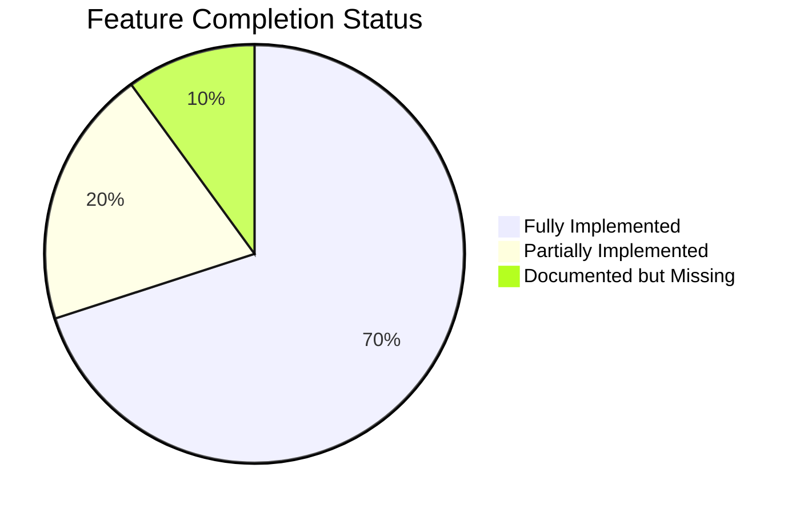
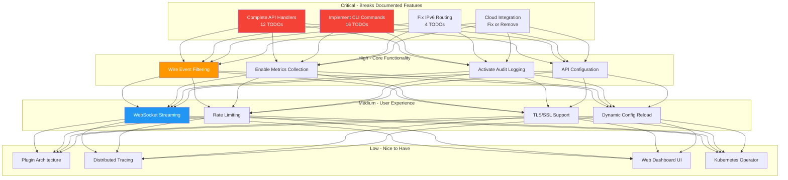

<!-- SPDX-License-Identifier: LGPL-3.0-or-later -->

# netevd Enhancement Roadmap

This document outlines potential improvements and future development priorities for netevd.

## 🎯 Current Status

Based on codebase analysis, we've identified **56 TODO items** and several partially implemented features.



## 📊 Enhancement Priorities



## 🔴 Critical Fixes (v0.2.1)

### 1. Complete API Handlers

**Problem:** 8 of 9 API endpoints return dummy/stub data

**Files:** `src/api/handlers.rs`

**Impact:** REST API is advertised but non-functional

**Tasks:**
- [ ] Track actual uptime (`/api/v1/status`)
- [ ] Count events processed
- [ ] Query actual interface state
- [ ] Implement route listing (`/api/v1/routes`)
- [ ] Fetch routing rule priorities
- [ ] Implement event history (`/api/v1/events`)
- [ ] Implement config reload (`POST /api/v1/reload`)
- [ ] Real health checks (`/health`)
- [ ] Connect metrics endpoint to registry (`/metrics`)

**Estimated Effort:** 8-12 hours

---

### 2. Implement CLI Commands

**Problem:** All `netevd` CLI commands are stubs

**Files:** `src/cli/handler.rs`

**Impact:** CLI tools don't work

**Tasks:**
- [ ] Add HTTP client (reqwest dependency)
- [ ] Implement API call functions:
  - [ ] `get_status()`
  - [ ] `get_interfaces()`
  - [ ] `get_interface(name)`
  - [ ] `get_routes()`
  - [ ] `get_rules()`
  - [ ] `get_events()`
  - [ ] `reload_config()`
- [ ] Implement event streaming (SSE)
- [ ] Implement script test execution

**Estimated Effort:** 6-8 hours

---

### 3. Fix IPv6 Routing Support

**Problem:** IPv6 advertised but routing rules don't work

**Files:** `src/network/ipv6.rs`

**Impact:** IPv6 multi-homing broken

**Options:**
1. Wait for rtnetlink IPv6 support, or
2. Fallback to `ip -6 rule add` commands

**Tasks:**
- [ ] Implement `add_ipv6_routing_rule()`
- [ ] Implement `remove_ipv6_routing_rule()`
- [ ] Implement `add_ipv6_default_route()`
- [ ] Implement `remove_ipv6_default_route()`
- [ ] Add integration tests
- [ ] Document limitations

**Estimated Effort:** 4-6 hours

---

### 4. Cloud Integration Decision

**Problem:** AWS/Azure/GCP code is all stubs

**Files:** `src/cloud/*.rs`

**Impact:** Misleading documentation

**Options:**
1. **Complete implementations** (20+ hours)
2. **Mark as experimental** and document
3. **Remove from README** until implemented

**Recommendation:** Option 2 - Mark as experimental feature flags

**Tasks:**
- [ ] Add `cloud-aws`, `cloud-azure`, `cloud-gcp` feature flags
- [ ] Update README to mark as experimental
- [ ] Add warning in docs
- [ ] Create tracking issues for full implementation

**Estimated Effort:** 1 hour (option 2)

---

## 🟠 High Priority (v0.3.0)

### 5. Wire Event Filtering

**Status:** Code exists but never used

**Files:** `src/filters/mod.rs`, `src/main.rs`

**Tasks:**
- [ ] Add `[filters]` section to config schema
- [ ] Load filters in main.rs
- [ ] Pass filters to listener modules
- [ ] Apply filters before script execution
- [ ] Add filter validation in config loader
- [ ] Document filter syntax in CONFIGURATION.md
- [ ] Add filtering examples

**Example Config:**
```yaml
filters:
  - name: "Only VPN interfaces"
    interface_pattern: "wg*"
    event_types: [routable, carrier]
    action: execute

  - name: "Ignore temporary interfaces"
    interface_pattern: "veth*"
    action: ignore
```

**Estimated Effort:** 4-6 hours

---

### 6. Enable Metrics Collection

**Status:** Infrastructure exists, never incremented

**Files:** `src/metrics/mod.rs`, all event handlers

**Tasks:**
- [ ] Create `MetricsHandle` in main.rs
- [ ] Inject into API state
- [ ] Increment counters in:
  - [ ] Event handlers (address/route/link watchers)
  - [ ] Script execution
  - [ ] DBus operations
  - [ ] Netlink operations
  - [ ] API requests
- [ ] Connect `/metrics` endpoint to real registry
- [ ] Add Grafana dashboard template
- [ ] Document all metrics in METRICS.md

**Estimated Effort:** 6-8 hours

---

### 7. Activate Audit Logging

**Status:** Logger exists but never called

**Files:** `src/audit/mod.rs`, all modules

**Tasks:**
- [ ] Add `[audit]` config section
- [ ] Create AuditLogger in main.rs
- [ ] Inject into:
  - [ ] API handlers
  - [ ] Event listeners
  - [ ] Script executor
- [ ] Log events:
  - [ ] Network state changes
  - [ ] Script executions
  - [ ] API requests
  - [ ] Config changes
- [ ] Add log rotation
- [ ] Add audit query endpoint
- [ ] Document audit format

**Estimated Effort:** 4-6 hours

---

### 8. API Configuration Support

**Status:** API runs but ignores config

**Files:** `src/config/mod.rs`, `src/api/server.rs`

**Tasks:**
- [ ] Add `[api]` config section:
  ```yaml
  api:
    enabled: true
    bind_address: "0.0.0.0"
    port: 9090
    request_timeout_seconds: 30
  ```
- [ ] Pass config to server startup
- [ ] Add config validation
- [ ] Allow disabling API entirely
- [ ] Update documentation

**Estimated Effort:** 2-3 hours

---

## 🔵 Medium Priority (v0.4.0)

### 9. WebSocket Event Streaming

**Use Case:** Real-time event monitoring in web UIs

**Tasks:**
- [ ] Add WebSocket route to API
- [ ] Implement event broadcast channel
- [ ] Send events to connected clients
- [ ] Add client reconnection logic
- [ ] Update API.md with WebSocket examples
- [ ] Create JavaScript client example

**Estimated Effort:** 8-10 hours

---

### 10. Rate Limiting

**Use Case:** Prevent API abuse

**Tasks:**
- [ ] Add `tower-governor` dependency
- [ ] Add rate limit config:
  ```yaml
  api:
    rate_limiting:
      enabled: true
      requests_per_minute: 60
      per_ip: true
  ```
- [ ] Implement middleware
- [ ] Add rate limit headers
- [ ] Add 429 Too Many Requests response
- [ ] Document limits

**Estimated Effort:** 3-4 hours

---

### 11. TLS/SSL Support

**Use Case:** Secure API access

**Tasks:**
- [ ] Add rustls dependency
- [ ] Add TLS config:
  ```yaml
  api:
    tls:
      enabled: true
      cert_file: /etc/netevd/certs/server.crt
      key_file: /etc/netevd/certs/server.key
  ```
- [ ] Load certificates
- [ ] Configure Axum for HTTPS
- [ ] Add client cert validation (optional)
- [ ] Document setup

**Estimated Effort:** 6-8 hours

---

### 12. Dynamic Configuration Reload

**Use Case:** Update config without restart

**Tasks:**
- [ ] Implement `POST /api/v1/reload` handler
- [ ] Add signal handler (SIGHUP)
- [ ] Reload config file
- [ ] Update filter rules
- [ ] Restart listeners if backend changed
- [ ] Maintain network state
- [ ] Add validation before reload
- [ ] Document reload behavior

**Estimated Effort:** 8-10 hours

---

## ⚪ Low Priority (v0.5.0+)

### 13. Plugin Architecture

**Vision:** Native Rust plugins for extensibility

**Concept:**
```rust
trait NetevdPlugin {
    fn on_event(&self, event: &NetworkEvent) -> Result<()>;
    fn on_interface_up(&self, interface: &Interface) -> Result<()>;
}
```

**Tasks:**
- [ ] Define plugin trait
- [ ] Implement plugin loader
- [ ] Add plugin configuration
- [ ] Create example plugins
- [ ] Document plugin development
- [ ] Add plugin marketplace/registry

**Estimated Effort:** 20-30 hours

---

### 14. Distributed Tracing

**Vision:** OpenTelemetry integration for debugging

**Tasks:**
- [ ] Add `opentelemetry` dependencies
- [ ] Configure tracing exporter
- [ ] Add trace IDs to logs
- [ ] Instrument API handlers
- [ ] Instrument event processing
- [ ] Add Jaeger/Zipkin examples
- [ ] Document tracing setup

**Estimated Effort:** 10-12 hours

---

### 15. Web Dashboard UI

**Vision:** Real-time monitoring interface

**Features:**
- Interface status cards
- Live event stream
- Route/rule visualization
- Script execution history
- Configuration editor
- Log viewer

**Tech Stack:**
- HTML/CSS/JavaScript (vanilla or Svelte)
- WebSocket for real-time updates
- Chart.js for graphs

**Tasks:**
- [ ] Design UI mockups
- [ ] Create HTML/CSS layout
- [ ] Implement WebSocket client
- [ ] Add API integration
- [ ] Add chart visualizations
- [ ] Bundle with binary or serve separately

**Estimated Effort:** 40-60 hours

---

### 16. Kubernetes Operator

**Status:** CRD exists, operator missing

**Vision:** Manage network policies via Kubernetes

**Tasks:**
- [ ] Implement operator logic
- [ ] Watch NetworkEventPolicy CRDs
- [ ] Create DaemonSet per policy
- [ ] Update netevd config from CRD
- [ ] Add status reporting
- [ ] Write operator guide
- [ ] Publish Helm chart

**Estimated Effort:** 30-40 hours

---

## 🔧 Technical Debt

### Code Quality

- [ ] Reduce code duplication in listeners
- [ ] Extract common patterns to helper functions
- [ ] Add more inline documentation
- [ ] Improve error messages
- [ ] Add builder patterns for complex types

### Testing

- [ ] Unit tests for all stub implementations
- [ ] Integration tests for API endpoints
- [ ] E2E tests for CLI commands
- [ ] Performance benchmarks
- [ ] Fuzz testing for input validation
- [ ] Test coverage >80%

### Documentation

- [ ] Video tutorials (YouTube)
- [ ] Interactive configuration generator
- [ ] Migration guides
- [ ] Performance tuning guide
- [ ] Security hardening guide
- [ ] FAQ section
- [ ] Glossary

---

## 🚀 Feature Requests from Community

Add community-requested features here as issues are filed.

### Requested Features

- [ ] systemd socket activation
- [ ] JSON output for all CLI commands
- [ ] Configuration file includes
- [ ] Script output capture and logging
- [ ] Email/webhook notifications
- [ ] Integration with service mesh (Istio, Linkerd)
- [ ] BGP route announcements
- [ ] VRRP/keepalived integration

---

## 📅 Release Schedule

| Version | Target Date | Focus | Status |
|---------|-------------|-------|--------|
| v0.2.1 | Feb 2026 | Critical fixes (API, CLI, IPv6) | Planned |
| v0.3.0 | Mar 2026 | Event filtering, metrics, audit | Planned |
| v0.4.0 | May 2026 | WebSocket, rate limiting, TLS | Planned |
| v0.5.0 | Jul 2026 | Plugin architecture, dashboard | Planned |
| v1.0.0 | Q4 2026 | Production-ready, all features complete | Planned |

---

## 🤝 Contributing

We welcome contributions! Priority areas:

1. **Critical fixes** - Implement stub API/CLI handlers
2. **Wire existing code** - Connect filters, metrics, audit logging
3. **Documentation** - Improve examples and guides
4. **Testing** - Increase test coverage

See [CONTRIBUTING.md](CONTRIBUTING.md) for development setup.

---

## 📝 Notes

- Feature flags will be used for experimental features
- Backward compatibility maintained for configuration
- API versioning (v1, v2) for breaking changes
- Semantic versioning for releases

---

**Last Updated:** 2026-01-23
**Maintainer:** Susant Sahani <ssahani@redhat.com>
