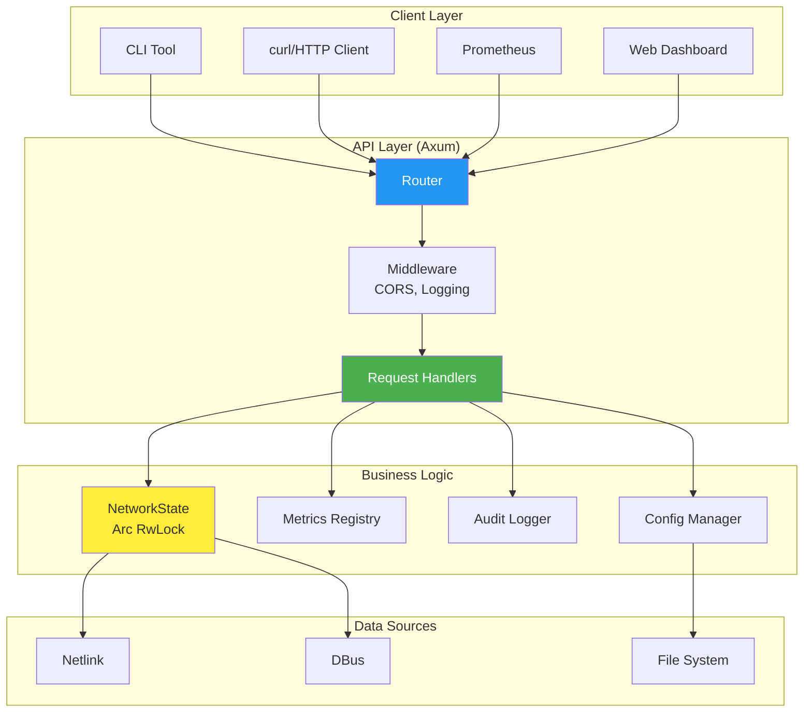
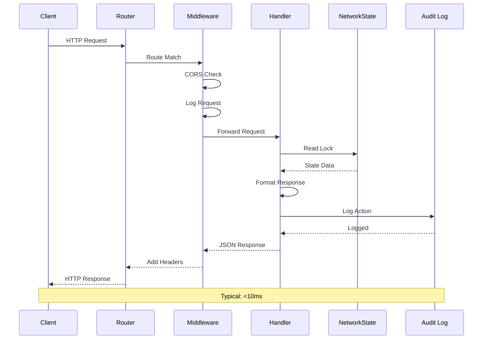

<!-- SPDX-License-Identifier: LGPL-3.0-or-later -->

# REST API Documentation

netevd provides a comprehensive REST API for monitoring and managing network configuration.

## Table of Contents

- [Overview](#overview)
- [Configuration](#configuration)
- [Authentication](#authentication)
- [Endpoints](#endpoints)
- [Data Models](#data-models)
- [Error Handling](#error-handling)
- [Examples](#examples)

## Overview

### API Architecture



### Request Flow



## Configuration

Enable the API in `/etc/netevd/netevd.yaml`:

```yaml
api:
  enabled: true
  bind_address: "0.0.0.0"  # Listen on all interfaces
  port: 9090
  cors:
    enabled: true
    allowed_origins:
      - "http://localhost:3000"
      - "https://dashboard.example.com"
  rate_limiting:
    enabled: true
    requests_per_minute: 60
  tls:
    enabled: false
    cert_file: "/etc/netevd/certs/server.crt"
    key_file: "/etc/netevd/certs/server.key"
```

### Starting the API Server

```bash
# Start netevd with API enabled
sudo systemctl start netevd

# Verify API is running
curl http://localhost:9090/health

# Check logs
sudo journalctl -u netevd | grep "API server"
```

## Authentication

**Current Status:** No authentication (designed for internal networks)

**Security Recommendations:**

1. **Bind to localhost only** (for local access):
   ```yaml
   api:
     bind_address: "127.0.0.1"
   ```

2. **Use reverse proxy** (nginx/Apache) with authentication:
   ```nginx
   location /api/ {
       auth_basic "Restricted";
       auth_basic_user_file /etc/nginx/.htpasswd;
       proxy_pass http://127.0.0.1:9090/api/;
   }
   ```

3. **Network isolation** (firewall rules):
   ```bash
   # Allow only from specific IP
   sudo iptables -A INPUT -p tcp --dport 9090 -s 192.168.1.0/24 -j ACCEPT
   sudo iptables -A INPUT -p tcp --dport 9090 -j DROP
   ```

## Endpoints

### 1. Status Endpoint

**GET** `/api/v1/status`

Returns daemon status information.

**Response:**
```json
{
  "status": "ok",
  "version": "0.2.0",
  "uptime_seconds": 86400,
  "backend": "systemd-networkd",
  "interfaces_monitored": 3,
  "events_processed": 1542,
  "scripts_executed": 89,
  "last_event": "2026-01-23T10:30:45Z"
}
```

**Example:**
```bash
curl http://localhost:9090/api/v1/status | jq
```

---

### 2. List Interfaces

**GET** `/api/v1/interfaces`

Returns all monitored network interfaces.

**Query Parameters:**
- `state` (optional): Filter by state (`up`, `down`, `unknown`)
- `type` (optional): Filter by type (`ethernet`, `wireless`, `loopback`)

**Response:**
```json
{
  "interfaces": [
    {
      "name": "eth0",
      "index": 2,
      "state": "up",
      "type": "ethernet",
      "mac_address": "00:11:22:33:44:55",
      "mtu": 1500,
      "addresses": [
        {
          "ip": "192.168.1.100",
          "prefix": 24,
          "family": "ipv4",
          "scope": "global"
        }
      ],
      "flags": ["UP", "BROADCAST", "RUNNING", "MULTICAST"]
    }
  ],
  "count": 1
}
```

**Example:**
```bash
# List all interfaces
curl http://localhost:9090/api/v1/interfaces | jq

# Filter by state
curl "http://localhost:9090/api/v1/interfaces?state=up" | jq
```

---

### 3. Show Interface Details

**GET** `/api/v1/interfaces/:name`

Returns detailed information about a specific interface.

**Path Parameters:**
- `name`: Interface name (e.g., `eth0`)

**Response:**
```json
{
  "name": "eth0",
  "index": 2,
  "state": "up",
  "type": "ethernet",
  "mac_address": "00:11:22:33:44:55",
  "mtu": 1500,
  "addresses": [
    {
      "ip": "192.168.1.100",
      "prefix": 24,
      "family": "ipv4",
      "scope": "global",
      "valid_lft": 86400,
      "preferred_lft": 86400
    }
  ],
  "routes": [
    {
      "destination": "0.0.0.0/0",
      "gateway": "192.168.1.1",
      "metric": 100,
      "table": "main"
    }
  ],
  "dns_servers": ["8.8.8.8", "8.8.4.4"],
  "flags": ["UP", "BROADCAST", "RUNNING", "MULTICAST"],
  "statistics": {
    "rx_packets": 12345,
    "tx_packets": 67890,
    "rx_bytes": 1234567890,
    "tx_bytes": 9876543210
  }
}
```

**Example:**
```bash
curl http://localhost:9090/api/v1/interfaces/eth0 | jq
```

---

### 4. List Routes

**GET** `/api/v1/routes`

Returns routing table entries.

**Query Parameters:**
- `interface` (optional): Filter by interface name
- `table` (optional): Filter by routing table (`main`, `local`, or number)
- `family` (optional): `ipv4` or `ipv6`

**Response:**
```json
{
  "routes": [
    {
      "destination": "0.0.0.0/0",
      "gateway": "192.168.1.1",
      "interface": "eth0",
      "metric": 100,
      "table": "main",
      "protocol": "boot",
      "scope": "universe",
      "type": "unicast"
    },
    {
      "destination": "192.168.1.0/24",
      "gateway": null,
      "interface": "eth0",
      "metric": 0,
      "table": "main",
      "protocol": "kernel",
      "scope": "link"
    }
  ],
  "count": 2
}
```

**Example:**
```bash
# All routes
curl http://localhost:9090/api/v1/routes | jq

# Routes for specific interface
curl "http://localhost:9090/api/v1/routes?interface=eth0" | jq

# Routes in custom table
curl "http://localhost:9090/api/v1/routes?table=203" | jq
```

---

### 5. List Routing Policy Rules

**GET** `/api/v1/rules`

Returns routing policy rules.

**Query Parameters:**
- `interface` (optional): Filter by interface
- `family` (optional): `ipv4` or `ipv6`

**Response:**
```json
{
  "rules": [
    {
      "priority": 32765,
      "from": "192.168.1.100/32",
      "to": null,
      "table": 203,
      "action": "lookup",
      "interface": "eth1"
    },
    {
      "priority": 32766,
      "from": null,
      "to": "192.168.1.100/32",
      "table": 203,
      "action": "lookup",
      "interface": "eth1"
    }
  ],
  "count": 2
}
```

**Example:**
```bash
curl http://localhost:9090/api/v1/rules | jq
```

---

### 6. Event History

**GET** `/api/v1/events`

Returns recent network events.

**Query Parameters:**
- `limit` (optional): Number of events (default: 100, max: 1000)
- `interface` (optional): Filter by interface
- `event_type` (optional): Filter by type (`link`, `address`, `route`, `carrier`)
- `since` (optional): ISO8601 timestamp

**Response:**
```json
{
  "events": [
    {
      "id": "evt-12345",
      "timestamp": "2026-01-23T10:30:45Z",
      "event_type": "address",
      "interface": "eth0",
      "action": "added",
      "details": {
        "address": "192.168.1.100/24",
        "family": "ipv4"
      }
    },
    {
      "id": "evt-12344",
      "timestamp": "2026-01-23T10:30:40Z",
      "event_type": "link",
      "interface": "eth0",
      "action": "up",
      "details": {
        "previous_state": "down"
      }
    }
  ],
  "count": 2,
  "has_more": false
}
```

**Example:**
```bash
# Recent events
curl http://localhost:9090/api/v1/events | jq

# Events for specific interface
curl "http://localhost:9090/api/v1/events?interface=eth0&limit=50" | jq

# Events since timestamp
curl "http://localhost:9090/api/v1/events?since=2026-01-23T10:00:00Z" | jq
```

---

### 7. Reload Configuration

**POST** `/api/v1/reload`

Reloads configuration without restarting daemon.

**Request Body:** None

**Response:**
```json
{
  "status": "success",
  "message": "Configuration reloaded successfully",
  "timestamp": "2026-01-23T10:35:00Z",
  "changes": {
    "interfaces_added": ["wlan0"],
    "interfaces_removed": [],
    "routing_rules_updated": true
  }
}
```

**Example:**
```bash
curl -X POST http://localhost:9090/api/v1/reload | jq
```

---

### 8. Health Check

**GET** `/health`

Health check endpoint for monitoring systems.

**Response:**
```json
{
  "status": "healthy",
  "checks": {
    "netlink": "ok",
    "dbus": "ok",
    "config": "ok",
    "backend": "ok"
  },
  "timestamp": "2026-01-23T10:40:00Z"
}
```

**Status Codes:**
- `200 OK`: All checks passed
- `503 Service Unavailable`: One or more checks failed

**Example:**
```bash
# Simple health check
curl http://localhost:9090/health

# Use in monitoring
curl -f http://localhost:9090/health || alert "netevd is down"
```

---

### 9. Prometheus Metrics

**GET** `/metrics`

Exports metrics in Prometheus text format.

**Response:**
```
# HELP netevd_uptime_seconds Time since netevd started
# TYPE netevd_uptime_seconds gauge
netevd_uptime_seconds 86400

# HELP netevd_events_total Total number of network events processed
# TYPE netevd_events_total counter
netevd_events_total{type="address",interface="eth0",backend="systemd-networkd"} 45
netevd_events_total{type="link",interface="eth0",backend="systemd-networkd"} 12

# HELP netevd_interfaces_total Number of monitored interfaces
# TYPE netevd_interfaces_total gauge
netevd_interfaces_total 3

# HELP netevd_script_executions_total Total script executions
# TYPE netevd_script_executions_total counter
netevd_script_executions_total{script="01-notify.sh",event_type="routable"} 89
```

**Prometheus Configuration:**
```yaml
scrape_configs:
  - job_name: 'netevd'
    static_configs:
      - targets: ['localhost:9090']
    metrics_path: '/metrics'
    scrape_interval: 15s
```

## Data Models

### Interface Model

```typescript
interface Interface {
  name: string;           // Interface name
  index: number;          // Kernel interface index
  state: "up" | "down" | "unknown";
  type: "ethernet" | "wireless" | "loopback" | "other";
  mac_address: string;    // MAC address (hex)
  mtu: number;           // MTU in bytes
  addresses: Address[];  // IP addresses
  routes?: Route[];      // Associated routes
  dns_servers?: string[]; // DNS servers
  flags: string[];       // Interface flags
  statistics?: Stats;    // Traffic statistics
}
```

### Address Model

```typescript
interface Address {
  ip: string;            // IP address
  prefix: number;        // Prefix length (CIDR)
  family: "ipv4" | "ipv6";
  scope: "global" | "link" | "host";
  valid_lft?: number;    // Valid lifetime (seconds)
  preferred_lft?: number; // Preferred lifetime (seconds)
}
```

### Route Model

```typescript
interface Route {
  destination: string;   // CIDR notation
  gateway: string | null; // Next hop
  interface: string;     // Outgoing interface
  metric: number;        // Route priority
  table: string | number; // Routing table
  protocol: string;      // Route source
  scope: string;         // Route scope
  type?: string;         // Route type
}
```

### Event Model

```typescript
interface Event {
  id: string;            // Unique event ID
  timestamp: string;     // ISO8601 timestamp
  event_type: "link" | "address" | "route" | "carrier";
  interface: string;     // Interface name
  action: "added" | "removed" | "modified" | "up" | "down";
  details: object;       // Event-specific details
}
```

## Error Handling

### Error Response Format

```json
{
  "error": {
    "code": "NOT_FOUND",
    "message": "Interface 'eth99' not found",
    "details": {
      "interface": "eth99",
      "available_interfaces": ["eth0", "eth1", "wlan0"]
    }
  },
  "timestamp": "2026-01-23T10:45:00Z"
}
```

### HTTP Status Codes

| Code | Meaning | When Used |
|------|---------|-----------|
| 200 | OK | Successful request |
| 201 | Created | Resource created (future use) |
| 400 | Bad Request | Invalid parameters |
| 404 | Not Found | Interface/route not found |
| 500 | Internal Server Error | Server error |
| 503 | Service Unavailable | Health check failed |

### Error Codes

| Code | Description |
|------|-------------|
| `INVALID_PARAMETER` | Invalid query parameter |
| `NOT_FOUND` | Resource not found |
| `INTERNAL_ERROR` | Internal server error |
| `UNAVAILABLE` | Service unavailable |
| `RATE_LIMITED` | Too many requests |

## Examples

### Monitoring Dashboard

```bash
#!/bin/bash
# Simple monitoring script

API="http://localhost:9090/api/v1"

# Get status
echo "=== Daemon Status ==="
curl -s "$API/status" | jq '.status, .uptime_seconds, .events_processed'

# List interfaces
echo -e "\n=== Interfaces ==="
curl -s "$API/interfaces" | jq -r '.interfaces[] | "\(.name): \(.state) - \(.addresses[0].ip)"'

# Check for routing rules
echo -e "\n=== Routing Rules ==="
curl -s "$API/rules" | jq -r '.rules[] | "Priority \(.priority): from \(.from) lookup table \(.table)"'

# Recent events
echo -e "\n=== Recent Events ==="
curl -s "$API/events?limit=5" | jq -r '.events[] | "\(.timestamp) [\(.event_type)] \(.interface): \(.action)"'
```

### Integration with Grafana

```json
{
  "dashboard": {
    "title": "netevd Monitoring",
    "panels": [
      {
        "title": "Interface States",
        "targets": [
          {
            "url": "http://localhost:9090/api/v1/interfaces",
            "format": "json"
          }
        ]
      },
      {
        "title": "Event Rate",
        "targets": [
          {
            "expr": "rate(netevd_events_total[5m])"
          }
        ]
      }
    ]
  }
}
```

### Automated Testing

```python
import requests
import time

API_BASE = "http://localhost:9090/api/v1"

def test_api():
    # Check health
    health = requests.get(f"{API_BASE.replace('/api/v1', '')}/health")
    assert health.status_code == 200
    assert health.json()["status"] == "healthy"

    # Get status
    status = requests.get(f"{API_BASE}/status")
    assert status.status_code == 200
    assert "version" in status.json()

    # List interfaces
    interfaces = requests.get(f"{API_BASE}/interfaces")
    assert interfaces.status_code == 200
    assert interfaces.json()["count"] > 0

    # Get specific interface
    iface_name = interfaces.json()["interfaces"][0]["name"]
    iface = requests.get(f"{API_BASE}/interfaces/{iface_name}")
    assert iface.status_code == 200
    assert iface.json()["name"] == iface_name

    print("All tests passed!")

if __name__ == "__main__":
    test_api()
```

## API Versioning

Current version: **v1**

Version is included in URL path: `/api/v1/...`

**Compatibility Promise:**
- Minor versions (v1.x): Backward compatible
- Major versions (v2.x): May break compatibility

## Rate Limiting

When enabled in configuration:

**Headers:**
```
X-RateLimit-Limit: 60
X-RateLimit-Remaining: 59
X-RateLimit-Reset: 1642944000
```

**Response when limited:**
```json
{
  "error": {
    "code": "RATE_LIMITED",
    "message": "Rate limit exceeded. Try again in 60 seconds.",
    "retry_after": 60
  }
}
```

## WebSocket Support (Future)

Planned for v0.3.0: Real-time event streaming via WebSocket

```javascript
const ws = new WebSocket('ws://localhost:9090/api/v1/events/stream');

ws.onmessage = (event) => {
  const networkEvent = JSON.parse(event.data);
  console.log(`${networkEvent.interface}: ${networkEvent.action}`);
};
```

## See Also

- [METRICS.md](METRICS.md) - Prometheus metrics documentation
- [CONFIGURATION.md](../CONFIGURATION.md) - Configuration options
- [README.md](../README.md) - Main documentation
