<!-- SPDX-License-Identifier: LGPL-3.0-or-later -->

# Architecture Deep Dive

This document provides a comprehensive technical overview of netevd's internal architecture.

## Table of Contents

- [System Architecture](#system-architecture)
- [Concurrency Model](#concurrency-model)
- [State Management](#state-management)
- [Event Processing Pipeline](#event-processing-pipeline)
- [Backend Implementations](#backend-implementations)
- [Network Operations](#network-operations)
- [Security Architecture](#security-architecture)
- [Performance Optimizations](#performance-optimizations)

## System Architecture

### High-Level Architecture

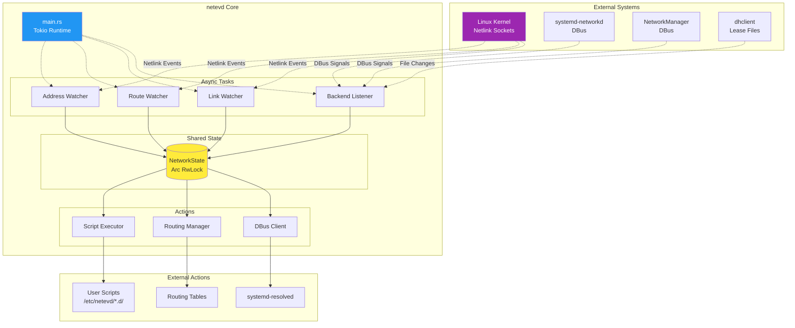

### Component Layers

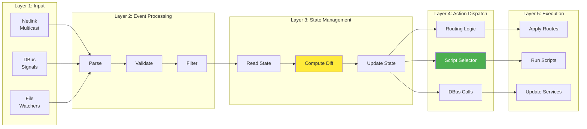

## Concurrency Model

### Tokio Runtime Architecture

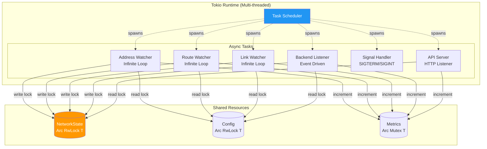

### Event Loop Structure

```rust
#[tokio::main]
async fn main() -> Result<()> {
    // Initialize shared state
    let state = Arc::new(RwLock::new(NetworkState::new()));
    let config = Arc::new(RwLock::new(load_config()?));

    // Spawn concurrent tasks
    tokio::select! {
        // Netlink watchers (high priority)
        _ = watch_addresses(state.clone(), config.clone()) => {
            error!("Address watcher stopped");
        }
        _ = watch_routes(state.clone(), config.clone()) => {
            error!("Route watcher stopped");
        }
        _ = watch_links(state.clone(), config.clone()) => {
            error!("Link watcher stopped");
        }

        // Backend listener (event-driven)
        _ = spawn_listener(state.clone(), config.clone()) => {
            error!("Backend listener stopped");
        }

        // API server (if enabled)
        _ = api_server(state.clone(), config.clone()) => {
            error!("API server stopped");
        }

        // Signal handler (graceful shutdown)
        _ = signal_handler() => {
            info!("Received shutdown signal");
        }
    }

    Ok(())
}
```

### Lock Strategy

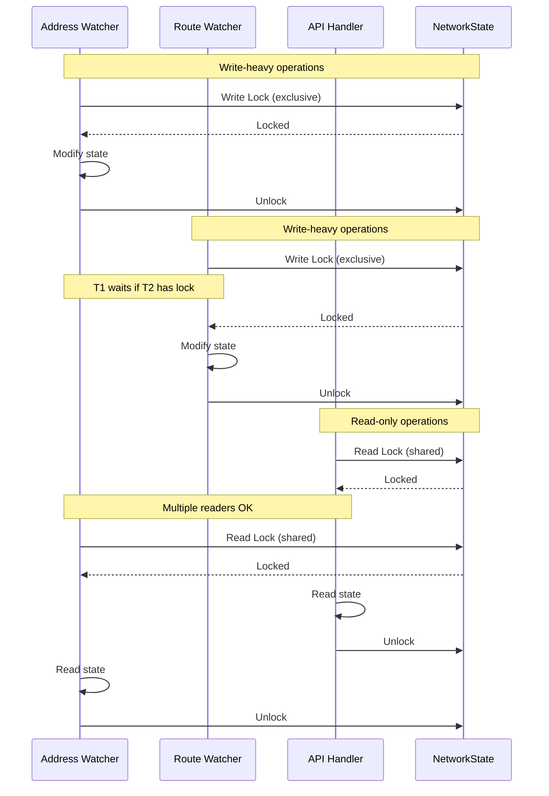

## State Management

### NetworkState Structure

```rust
pub struct NetworkState {
    // Link name <-> Index bidirectional mapping
    links: HashMap<String, u32>,           // name -> index
    link_names: HashMap<u32, String>,      // index -> name

    // Route tracking (key: interface_index + table_id)
    routes: HashMap<(u32, u32), Vec<Route>>,

    // Routing policy rules
    rules_from: HashMap<IpAddr, RoutingRule>,  // Source-based rules
    rules_to: HashMap<IpAddr, RoutingRule>,    // Dest-based rules

    // Interface state
    link_states: HashMap<u32, LinkState>,
}

pub struct LinkState {
    name: String,
    index: u32,
    flags: Vec<String>,
    operational_state: String,
    addresses: Vec<Address>,
    mtu: u32,
    mac: String,
}
```

### State Update Flow

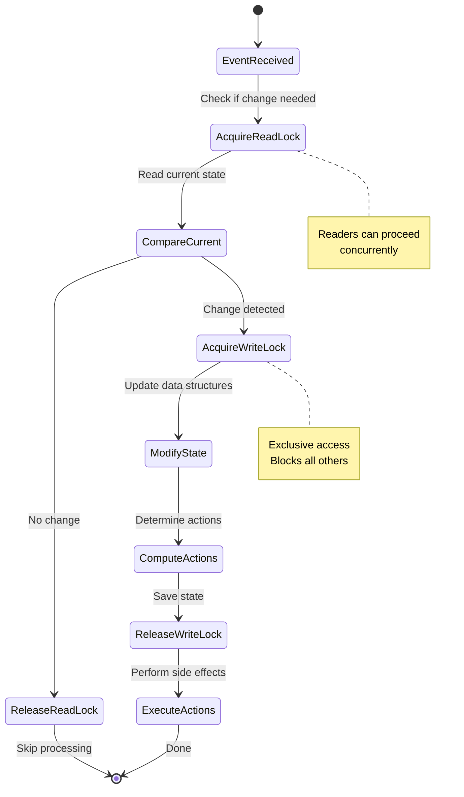

### State Synchronization

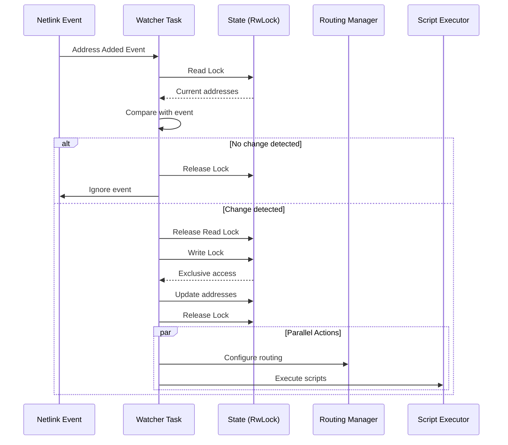

## Event Processing Pipeline

### Pipeline Stages

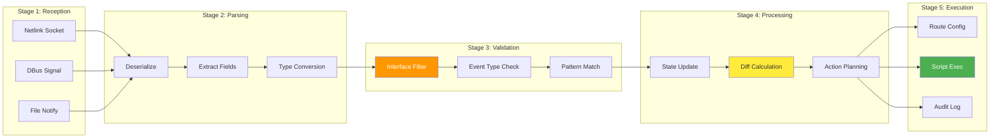

### Event Types and Handlers

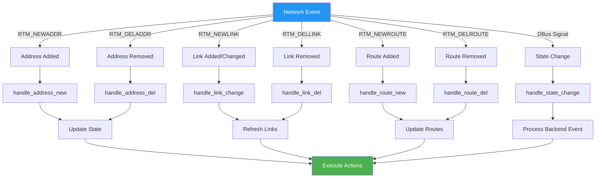

## Backend Implementations

### systemd-networkd Backend

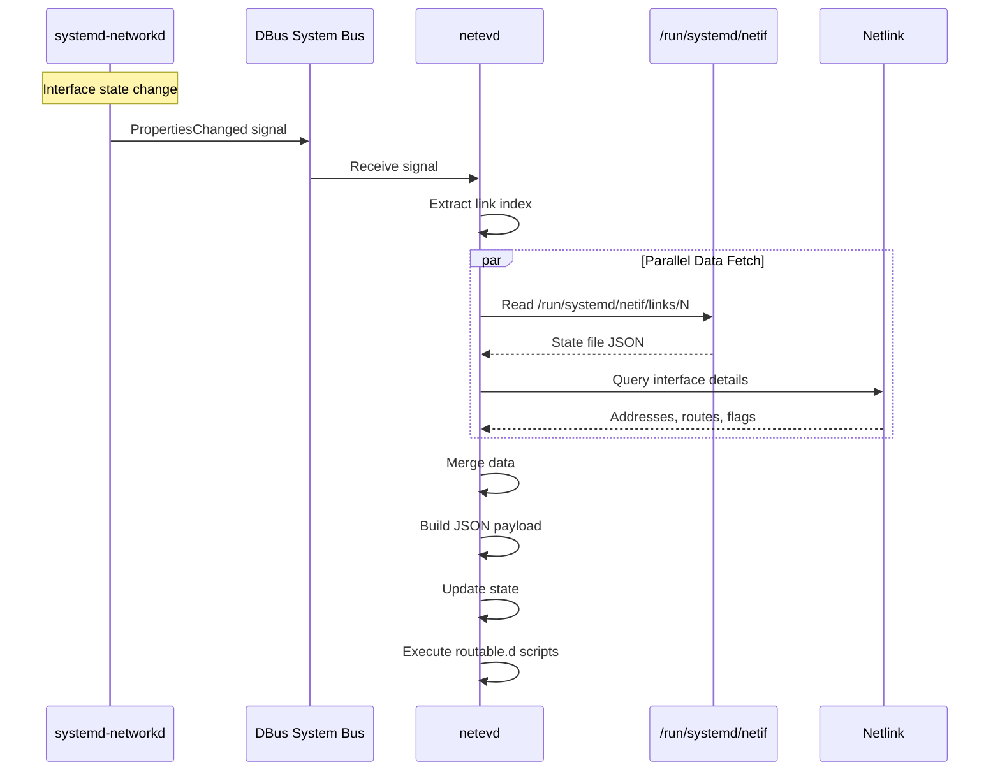

### NetworkManager Backend

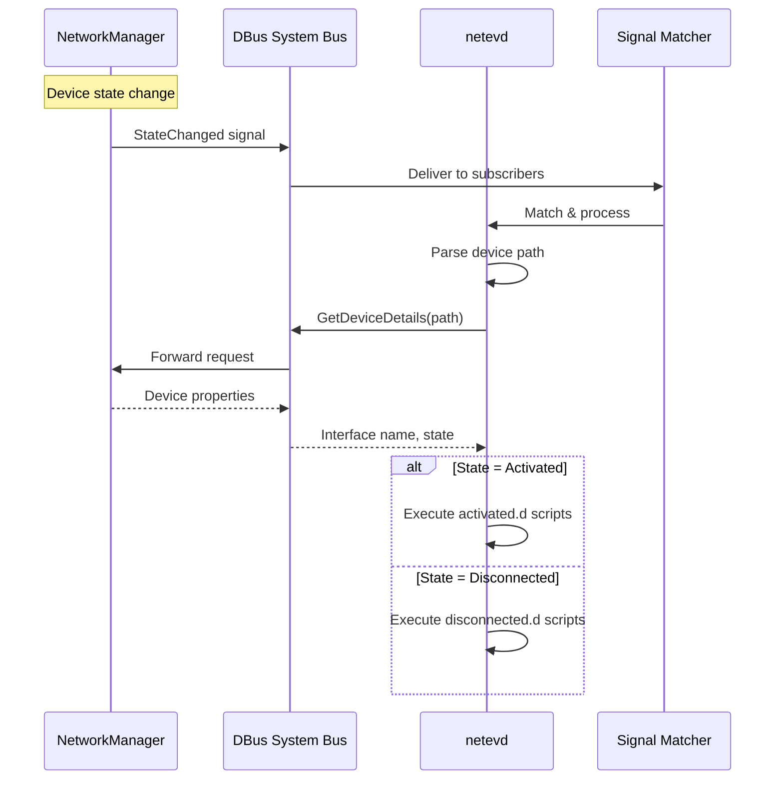

### dhclient Backend

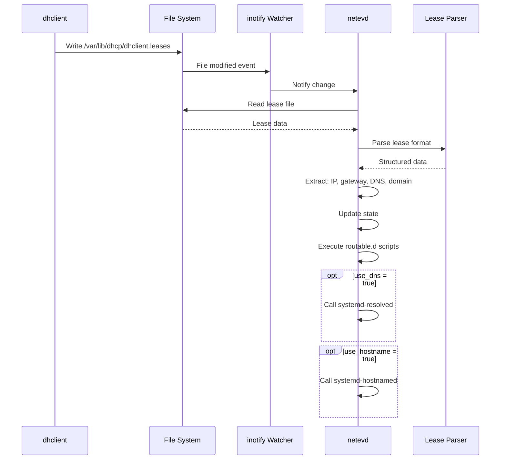

## Network Operations

### Routing Policy Rules Creation

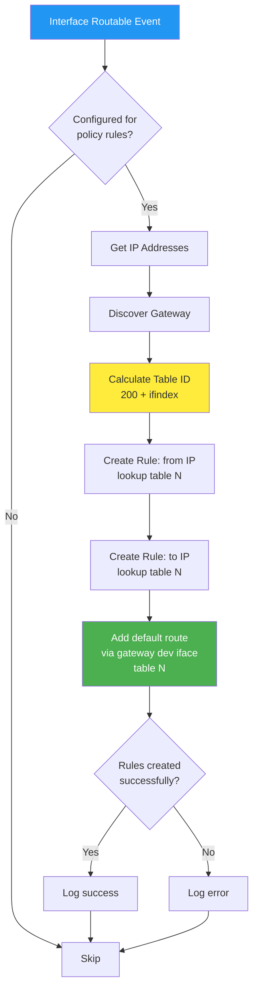

### Address Change Handling

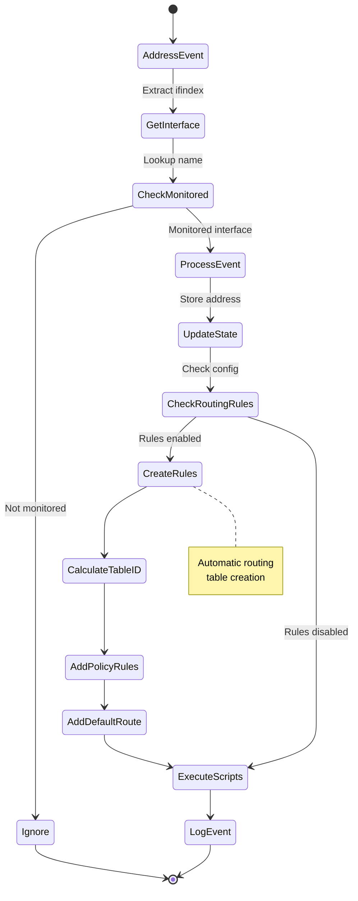

## Security Architecture

### Privilege Drop Sequence

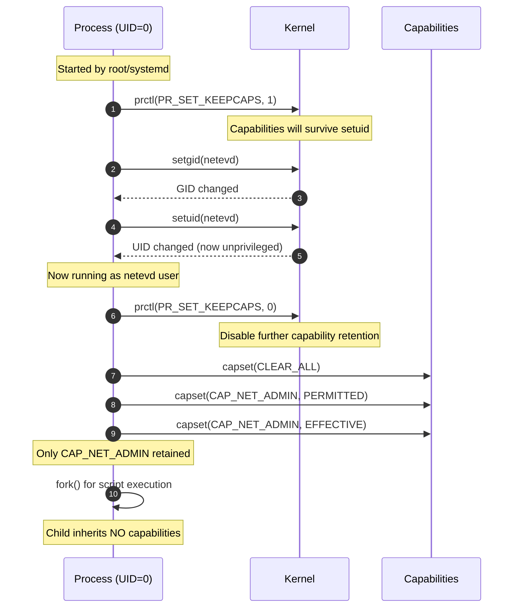

### Input Validation Layers

```mermaid
graph TD
    INPUT[External Input]

    INPUT --> L1[Layer 1: Type Validation]
    L1 -->|Interface Name| V1{Valid chars?<br/>alphanumeric, -, _, .}
    L1 -->|IP Address| V2{Valid IP?<br/>Parse with std::net}
    L1 -->|Hostname| V3{Valid hostname?<br/>RFC 1123}

    V1 -->|No| REJECT1[Reject]
    V2 -->|No| REJECT2[Reject]
    V3 -->|No| REJECT3[Reject]

    V1 -->|Yes| L2[Layer 2: Injection Check]
    V2 -->|Yes| L2
    V3 -->|Yes| L2

    L2 --> INJ{Contains shell<br/>metacharacters?}
    INJ -->|Yes: ; $ \` & |  | REJECT4[Reject]
    INJ -->|No| L3[Layer 3: Length Check]

    L3 --> LEN{Length within<br/>limits?}
    LEN -->|No| REJECT5[Reject]
    LEN -->|Yes| SANITIZE[Sanitize & Escape]

    SANITIZE --> SAFE[Safe to Use]

    REJECT1 & REJECT2 & REJECT3 & REJECT4 & REJECT5 --> LOG[Log Rejection]

    style INPUT fill:#2196f3,color:#fff
    style REJECT1 fill:#f44336,color:#fff
    style REJECT2 fill:#f44336,color:#fff
    style REJECT3 fill:#f44336,color:#fff
    style REJECT4 fill:#f44336,color:#fff
    style REJECT5 fill:#f44336,color:#fff
    style SAFE fill:#4caf50,color:#fff
```

## Performance Optimizations

### Memory Layout

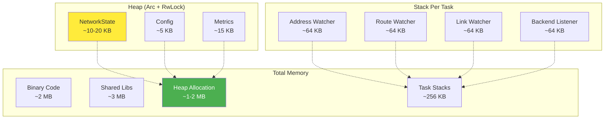

### Event Processing Performance

```mermaid
gantt
    title Event Processing Timeline
    dateFormat X
    axisFormat %L ms

    section Reception
    Netlink recv()           :0, 1

    section Parsing
    Deserialize              :1, 3

    section Validation
    Filter interface         :3, 4
    Check rules              :4, 5

    section State Update
    Acquire write lock       :5, 7
    Modify HashMap           :7, 9
    Release lock             :9, 10

    section Actions
    Configure routes         :10, 30
    Fork + exec script       :30, 100

    section Total
    Total latency            :milestone, 100, 100
```

### Optimization Techniques

1. **Lock Minimization**
   - Hold locks for minimum duration
   - Prefer read locks over write locks
   - Clone small data outside of locks

2. **Async I/O**
   - Non-blocking netlink sockets
   - Async DBus calls
   - Concurrent task execution

3. **Memory Efficiency**
   - Reuse buffers for netlink messages
   - HashMap for O(1) lookups
   - Arc for shared ownership (no cloning large data)

4. **Lazy Evaluation**
   - Only query netlink when needed
   - Cache interface index ↔ name mappings
   - Skip processing for unmonitored interfaces

## Module Dependencies

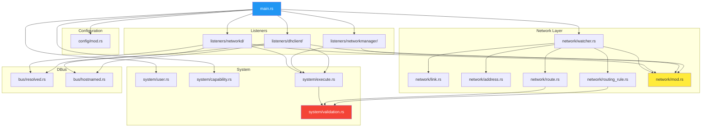

## Build and Compilation

### Build Pipeline

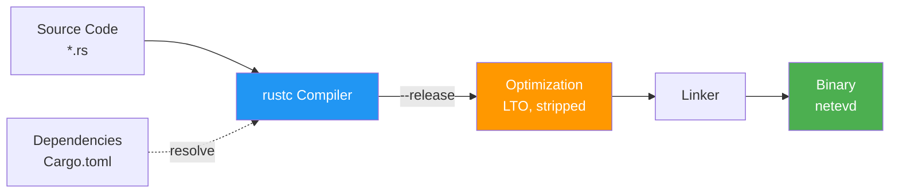

### Dependency Tree (Top-level)

```
netevd
├── tokio (async runtime)
│   ├── mio (system I/O)
│   └── parking_lot (synchronization)
├── rtnetlink (netlink operations)
│   ├── netlink-packet-route
│   └── futures
├── zbus (DBus async client)
│   └── zvariant
├── serde + serde_yaml (configuration)
├── nix (Unix system calls)
├── caps (Linux capabilities)
├── notify (file system events)
└── anyhow (error handling)
```

## See Also

- [README.md](../README.md) - Main documentation
- [API.md](API.md) - REST API reference
- [CONFIGURATION.md](../CONFIGURATION.md) - Configuration guide
- [CONTRIBUTING.md](../CONTRIBUTING.md) - Development guide
