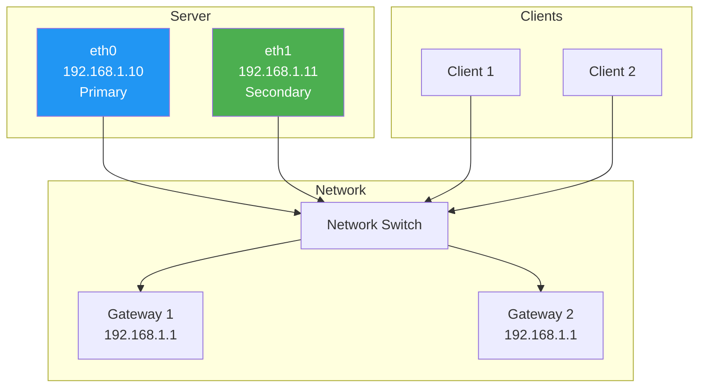
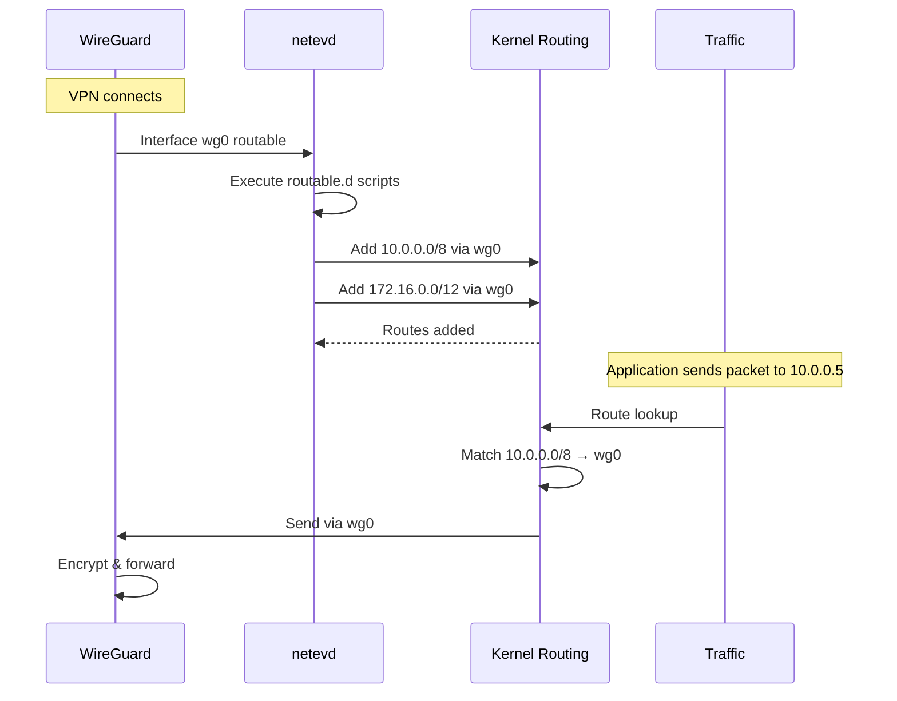
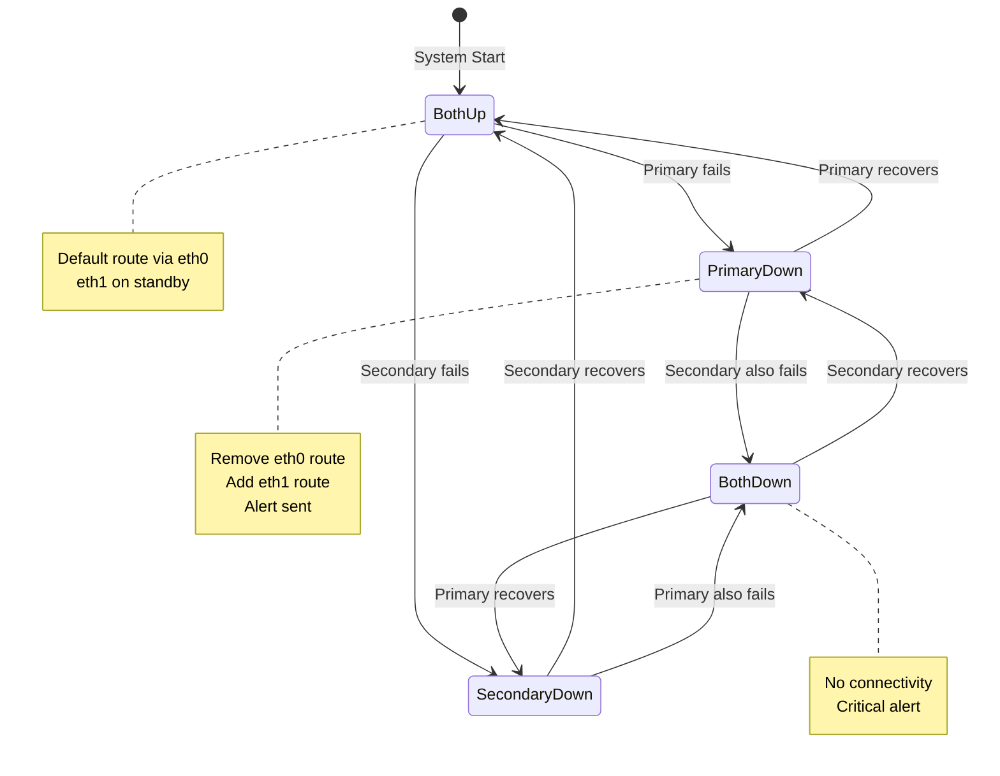
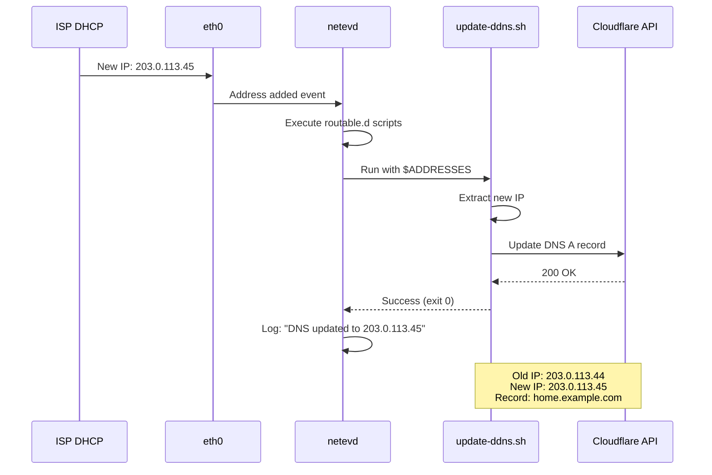

<!-- SPDX-License-Identifier: LGPL-3.0-or-later -->

# Real-World Examples

Comprehensive examples for common netevd use cases with step-by-step instructions.

## Table of Contents

- [Multi-Homed Server](#multi-homed-server)
- [VPN Integration](#vpn-integration)
- [High Availability Setup](#high-availability-setup)
- [Dynamic DNS Updates](#dynamic-dns-updates)
- [Cloud Monitoring Integration](#cloud-monitoring-integration)
- [Container Networking](#container-networking)
- [IoT Device Management](#iot-device-management)

## Multi-Homed Server

### Scenario

Server with two network interfaces in the same subnet. Traffic arriving on eth1 must leave via eth1 (symmetric routing).



### Configuration

**1. Network Setup (systemd-networkd)**

```ini
# /etc/systemd/network/10-eth0.network
[Match]
Name=eth0

[Network]
Address=192.168.1.10/24
Gateway=192.168.1.1
DNS=8.8.8.8
```

```ini
# /etc/systemd/network/20-eth1.network
[Match]
Name=eth1

[Network]
Address=192.168.1.11/24
# No default gateway - netevd will handle routing
```

**2. netevd Configuration**

```yaml
# /etc/netevd/netevd.yaml
system:
  log_level: "info"
  backend: "systemd-networkd"

monitoring:
  interfaces:
    - eth0
    - eth1

routing:
  policy_rules:
    - eth1  # Enable routing for secondary interface

backends:
  systemd_networkd:
    emit_json: true
```

**3. Apply Configuration**

```bash
# Reload network
sudo networkctl reload

# Start netevd
sudo systemctl restart netevd

# Verify routing rules created
ip rule list

# Should show:
# 32765: from 192.168.1.11 lookup 203
# 32766: to 192.168.1.11 lookup 203

# Verify custom table
ip route show table 203

# Should show:
# default via 192.168.1.1 dev eth1
```

### Testing

```bash
# Test traffic via eth1
curl --interface eth1 https://ifconfig.me

# Verify with tcpdump
sudo tcpdump -i eth1 -n host 192.168.1.11

# Test routing decision
ip route get 8.8.8.8 from 192.168.1.11

# Should output: ... dev eth1 table 203
```

### Monitoring Script

```bash
#!/bin/bash
# /etc/netevd/routable.d/01-log-routing.sh

if [ "$LINK" = "eth1" ]; then
    logger -t netevd "eth1 routing configured: $ADDRESSES"

    # Log routing table
    ip route show table 203 | logger -t netevd

    # Send metric to monitoring system
    echo "interface_routing{interface=\"$LINK\"} 1" | \
        curl --data-binary @- http://pushgateway:9091/metrics/job/netevd
fi
```

---

## VPN Integration

### Scenario

Automatically route specific networks through WireGuard VPN when it connects.



### Configuration

**1. WireGuard Setup**

```ini
# /etc/systemd/network/50-wg0.network
[Match]
Name=wg0

[Network]
Address=10.99.0.2/24
```

```ini
# /etc/wireguard/wg0.conf
[Interface]
PrivateKey = <your-private-key>
Address = 10.99.0.2/24
ListenPort = 51820

[Peer]
PublicKey = <server-public-key>
Endpoint = vpn.example.com:51820
AllowedIPs = 10.0.0.0/8, 172.16.0.0/12
PersistentKeepalive = 25
```

**2. netevd Configuration**

```yaml
system:
  backend: "systemd-networkd"

monitoring:
  interfaces:
    - wg0
    - eth0
```

**3. VPN Route Script**

```bash
#!/bin/bash
# /etc/netevd/routable.d/01-vpn-routes.sh

VPN_INTERFACE="wg0"
OFFICE_NETWORKS=(
    "10.0.0.0/8"
    "172.16.0.0/12"
)

if [ "$LINK" = "$VPN_INTERFACE" ] && [ "$STATE" = "routable" ]; then
    logger -t netevd-vpn "VPN interface $LINK is routable"

    for network in "${OFFICE_NETWORKS[@]}"; do
        # Add route
        ip route add "$network" dev "$VPN_INTERFACE" 2>/dev/null || {
            logger -t netevd-vpn "Route $network already exists"
        }

        logger -t netevd-vpn "Added route: $network via $VPN_INTERFACE"
    done

    # Update firewall
    iptables -A FORWARD -i "$VPN_INTERFACE" -j ACCEPT
    iptables -A FORWARD -o "$VPN_INTERFACE" -j ACCEPT

    logger -t netevd-vpn "VPN routing configured successfully"
fi
```

**4. VPN Disconnect Cleanup**

```bash
#!/bin/bash
# /etc/netevd/no-carrier.d/01-vpn-cleanup.sh

VPN_INTERFACE="wg0"

if [ "$LINK" = "$VPN_INTERFACE" ]; then
    logger -t netevd-vpn "VPN interface $LINK lost carrier, cleaning up"

    # Routes are automatically removed by kernel
    # But we can log it
    logger -t netevd-vpn "VPN routes automatically cleaned up"
fi
```

**5. Make Scripts Executable**

```bash
sudo chmod +x /etc/netevd/routable.d/01-vpn-routes.sh
sudo chmod +x /etc/netevd/no-carrier.d/01-vpn-cleanup.sh
```

### Testing

```bash
# Start VPN
sudo wg-quick up wg0

# Check routes
ip route | grep wg0

# Should show:
# 10.0.0.0/8 dev wg0 scope link
# 172.16.0.0/12 dev wg0 scope link

# Test connectivity
ping -c 3 10.0.0.1

# Check logs
sudo journalctl -t netevd-vpn
```

---

## High Availability Setup

### Scenario

Two interfaces with failover. Primary fails over to secondary automatically.



### Configuration

**1. netevd Configuration**

```yaml
system:
  backend: "systemd-networkd"

monitoring:
  interfaces:
    - eth0  # Primary
    - eth1  # Secondary
```

**2. Failover Script**

```bash
#!/bin/bash
# /etc/netevd/no-carrier.d/01-failover.sh

PRIMARY="eth0"
SECONDARY="eth1"
SECONDARY_GW="192.168.2.1"
ALERT_EMAIL="admin@example.com"
ALERT_WEBHOOK="https://alerting.example.com/webhook"

if [ "$LINK" = "$PRIMARY" ]; then
    logger -t netevd-ha "PRIMARY INTERFACE DOWN: $PRIMARY"

    # Check if secondary is up
    if ip link show "$SECONDARY" | grep -q "state UP"; then
        logger -t netevd-ha "Failing over to $SECONDARY"

        # Add default route via secondary
        ip route add default via "$SECONDARY_GW" dev "$SECONDARY" metric 100 2>/dev/null

        # Flush route cache
        ip route flush cache

        # Send alert
        echo "Primary interface $PRIMARY failed. Failover to $SECONDARY active." | \
            mail -s "ALERT: Network Failover on $(hostname)" "$ALERT_EMAIL"

        # Webhook notification
        curl -X POST "$ALERT_WEBHOOK" \
            -H "Content-Type: application/json" \
            -d "{
                \"event\": \"failover\",
                \"primary\": \"$PRIMARY\",
                \"secondary\": \"$SECONDARY\",
                \"hostname\": \"$(hostname)\",
                \"timestamp\": \"$(date -Iseconds)\"
            }"

        logger -t netevd-ha "Failover complete"
    else
        logger -t netevd-ha "CRITICAL: Both interfaces down!"

        # Critical alert
        echo "CRITICAL: Both $PRIMARY and $SECONDARY are down!" | \
            mail -s "CRITICAL: Total Network Failure on $(hostname)" "$ALERT_EMAIL"
    fi
fi
```

**3. Recovery Script**

```bash
#!/bin/bash
# /etc/netevd/carrier.d/01-failback.sh

PRIMARY="eth0"
SECONDARY="eth1"
PRIMARY_GW="192.168.1.1"
SECONDARY_GW="192.168.2.1"

if [ "$LINK" = "$PRIMARY" ]; then
    logger -t netevd-ha "Primary interface $PRIMARY recovered"

    # Wait a bit to ensure stability
    sleep 5

    # Remove secondary default route
    ip route del default via "$SECONDARY_GW" dev "$SECONDARY" 2>/dev/null

    # Ensure primary route exists
    ip route add default via "$PRIMARY_GW" dev "$PRIMARY" metric 50 2>/dev/null

    # Flush cache
    ip route flush cache

    logger -t netevd-ha "Failed back to primary interface $PRIMARY"

    # Send recovery notification
    echo "Primary interface $PRIMARY recovered. Normal routing restored." | \
        mail -s "INFO: Network Recovery on $(hostname)" "$ALERT_EMAIL"
fi
```

**4. Monitoring Script**

```bash
#!/bin/bash
# /etc/netevd/routable.d/01-ha-monitor.sh

# Track interface states
STATE_FILE="/var/run/netevd-ha-state"

echo "$(date -Iseconds): $LINK $STATE" >> "$STATE_FILE"

# Keep only last 100 entries
tail -n 100 "$STATE_FILE" > "${STATE_FILE}.tmp"
mv "${STATE_FILE}.tmp" "$STATE_FILE"

# Export metric
echo "interface_state{interface=\"$LINK\",state=\"$STATE\"} 1" | \
    curl --data-binary @- http://localhost:9091/metrics/job/netevd/instance/$(hostname)
```

---

## Dynamic DNS Updates

### Scenario

Automatically update DNS records when IP address changes (e.g., dynamic home IP).



### Configuration

**1. Cloudflare API Script**

```bash
#!/bin/bash
# /etc/netevd/routable.d/02-update-ddns.sh

# Configuration
INTERFACE="eth0"  # Only update for this interface
ZONE_ID="your-zone-id"
RECORD_ID="your-record-id"
RECORD_NAME="home.example.com"
API_TOKEN="your-cloudflare-api-token"
API_URL="https://api.cloudflare.com/client/v4"

# Only run for specific interface
if [ "$LINK" != "$INTERFACE" ]; then
    exit 0
fi

# Extract first IPv4 address
IP=$(echo "$ADDRESSES" | grep -oE '([0-9]{1,3}\.){3}[0-9]{1,3}' | head -1)

if [ -z "$IP" ]; then
    logger -t netevd-ddns "No IPv4 address found for $INTERFACE"
    exit 0
fi

logger -t netevd-ddns "Updating DNS for $RECORD_NAME to $IP"

# Update Cloudflare DNS
RESPONSE=$(curl -s -X PUT "$API_URL/zones/$ZONE_ID/dns_records/$RECORD_ID" \
    -H "Authorization: Bearer $API_TOKEN" \
    -H "Content-Type: application/json" \
    --data "{
        \"type\": \"A\",
        \"name\": \"$RECORD_NAME\",
        \"content\": \"$IP\",
        \"ttl\": 120,
        \"proxied\": false
    }")

# Check response
if echo "$RESPONSE" | grep -q '"success":true'; then
    logger -t netevd-ddns "Successfully updated $RECORD_NAME to $IP"
    echo "$(date -Iseconds): Updated $RECORD_NAME -> $IP" >> /var/log/ddns-updates.log
    exit 0
else
    logger -t netevd-ddns "ERROR: Failed to update DNS: $RESPONSE"
    exit 1
fi
```

**2. Alternative: DuckDNS**

```bash
#!/bin/bash
# /etc/netevd/routable.d/02-update-duckdns.sh

DOMAIN="yourdomain"  # your-domain.duckdns.org
TOKEN="your-duckdns-token"
INTERFACE="eth0"

if [ "$LINK" != "$INTERFACE" ]; then
    exit 0
fi

IP=$(echo "$ADDRESSES" | grep -oE '([0-9]{1,3}\.){3}[0-9]{1,3}' | head -1)

if [ -z "$IP" ]; then
    exit 0
fi

# Update DuckDNS
RESPONSE=$(curl -s "https://www.duckdns.org/update?domains=$DOMAIN&token=$TOKEN&ip=$IP")

if [ "$RESPONSE" = "OK" ]; then
    logger -t netevd-ddns "DuckDNS updated: $DOMAIN -> $IP"
    exit 0
else
    logger -t netevd-ddns "DuckDNS update failed: $RESPONSE"
    exit 1
fi
```

**3. Cache Previous IP to Avoid Redundant Updates**

```bash
#!/bin/bash
# /etc/netevd/routable.d/02-update-ddns-cached.sh

INTERFACE="eth0"
CACHE_FILE="/var/run/ddns-last-ip"
RECORD_NAME="home.example.com"

if [ "$LINK" != "$INTERFACE" ]; then
    exit 0
fi

IP=$(echo "$ADDRESSES" | grep -oE '([0-9]{1,3}\.){3}[0-9]{1,3}' | head -1)

if [ -z "$IP" ]; then
    exit 0
fi

# Check if IP changed
if [ -f "$CACHE_FILE" ]; then
    LAST_IP=$(cat "$CACHE_FILE")
    if [ "$IP" = "$LAST_IP" ]; then
        logger -t netevd-ddns "IP unchanged ($IP), skipping update"
        exit 0
    fi
fi

# Update DNS (your preferred provider here)
# ... update logic ...

# Cache new IP
echo "$IP" > "$CACHE_FILE"
logger -t netevd-ddns "Updated $RECORD_NAME: $LAST_IP -> $IP"
```

---

## Cloud Monitoring Integration

### Scenario

Send network events to cloud monitoring system (AWS CloudWatch, Datadog, etc.).

```bash
#!/bin/bash
# /etc/netevd/routable.d/03-cloudwatch-metrics.sh

AWS_REGION="us-east-1"
NAMESPACE="NetEvd"
HOSTNAME=$(hostname)

# Send metric to CloudWatch
aws cloudwatch put-metric-data \
    --region "$AWS_REGION" \
    --namespace "$NAMESPACE" \
    --metric-name InterfaceRouted \
    --value 1 \
    --dimensions Interface="$LINK",Host="$HOSTNAME",State="$STATE" \
    --timestamp "$(date -u +%Y-%m-%dT%H:%M:%S)"

logger -t netevd-cloudwatch "Sent metric: $LINK routable"
```

### Datadog Integration

```bash
#!/bin/bash
# /etc/netevd/routable.d/03-datadog-events.sh

DD_API_KEY="your-datadog-api-key"
HOSTNAME=$(hostname)

# Send event to Datadog
curl -X POST "https://api.datadoghq.com/api/v1/events" \
    -H "Content-Type: application/json" \
    -H "DD-API-KEY: $DD_API_KEY" \
    -d "{
        \"title\": \"Interface $LINK Routable\",
        \"text\": \"Interface $LINK on $HOSTNAME is now routable with IP $ADDRESSES\",
        \"priority\": \"normal\",
        \"tags\": [\"interface:$LINK\", \"host:$HOSTNAME\", \"state:$STATE\"],
        \"alert_type\": \"info\"
    }"

logger -t netevd-datadog "Sent event for $LINK"
```

---

## Container Networking

### Scenario

Automatically configure routing for Docker containers or pods.

```bash
#!/bin/bash
# /etc/netevd/routable.d/04-docker-routing.sh

DOCKER_NETWORK="172.17.0.0/16"
CONTAINER_INTERFACE="eth1"

if [ "$LINK" = "$CONTAINER_INTERFACE" ] && [ "$STATE" = "routable" ]; then
    # Add route for Docker network via container interface
    ip route add "$DOCKER_NETWORK" dev "$CONTAINER_INTERFACE" 2>/dev/null

    # Enable IP forwarding
    sysctl -w net.ipv4.ip_forward=1

    # Configure NAT
    iptables -t nat -A POSTROUTING -s "$DOCKER_NETWORK" -o "$CONTAINER_INTERFACE" -j MASQUERADE

    logger -t netevd-docker "Docker routing configured via $CONTAINER_INTERFACE"
fi
```

---

## IoT Device Management

### Scenario

Monitor IoT devices and alert on connectivity issues.

```bash
#!/bin/bash
# /etc/netevd/no-carrier.d/02-iot-alert.sh

IOT_INTERFACE="eth2"
IOT_DEVICES=(
    "192.168.3.10:sensor-1"
    "192.168.3.11:sensor-2"
    "192.168.3.12:camera-1"
)

if [ "$LINK" = "$IOT_INTERFACE" ]; then
    logger -t netevd-iot "IoT interface $LINK lost carrier"

    # Alert about affected devices
    MESSAGE="IoT network down! Affected devices:\n"
    for device in "${IOT_DEVICES[@]}"; do
        MESSAGE="$MESSAGE\n- ${device#*:} (${device%%:*})"
    done

    # Send to monitoring system
    curl -X POST https://monitoring.example.com/alerts \
        -H "Content-Type: application/json" \
        -d "{
            \"severity\": \"warning\",
            \"message\": \"$MESSAGE\",
            \"interface\": \"$LINK\"
        }"

    logger -t netevd-iot "Alert sent for $LINK"
fi
```

---

## Advanced: Conditional Execution

### Run Scripts Based on Conditions

```bash
#!/bin/bash
# /etc/netevd/routable.d/01-conditional.sh

# Only run during business hours (9 AM - 5 PM)
HOUR=$(date +%H)
if [ "$HOUR" -lt 9 ] || [ "$HOUR" -gt 17 ]; then
    logger -t netevd "Outside business hours, skipping"
    exit 0
fi

# Only run for specific interfaces
case "$LINK" in
    eth0|eth1)
        # Process these interfaces
        ;;
    *)
        # Ignore others
        exit 0
        ;;
esac

# Only run if JSON contains specific data
if [ -n "$JSON" ]; then
    MTU=$(echo "$JSON" | jq -r '.MTU')
    if [ "$MTU" -ne 1500 ]; then
        logger -t netevd "MTU is $MTU, adjusting to 1500"
        ip link set dev "$LINK" mtu 1500
    fi
fi

# Your main logic here
logger -t netevd "Processed $LINK during business hours"
```

---

## See Also

- [CONFIGURATION.md](../CONFIGURATION.md) - Configuration reference
- [API.md](API.md) - REST API documentation
- [TROUBLESHOOTING.md](TROUBLESHOOTING.md) - Problem solving
- [README.md](../README.md) - General documentation
