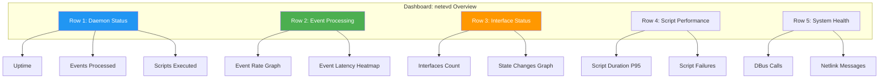
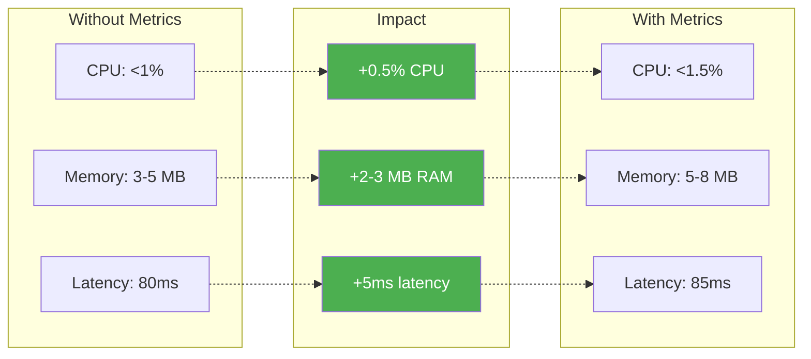

<!-- SPDX-License-Identifier: LGPL-3.0-or-later -->

# Prometheus Metrics Documentation

netevd exposes comprehensive metrics in Prometheus format for monitoring and alerting.

## Table of Contents

- [Overview](#overview)
- [Configuration](#configuration)
- [Metric Categories](#metric-categories)
- [Grafana Dashboards](#grafana-dashboards)
- [Alerting Rules](#alerting-rules)
- [Performance Impact](#performance-impact)

## Overview

### Metrics Architecture

```mermaid
graph TB
    subgraph "netevd Process"
        EVENTS[Event Handlers]
        SCRIPTS[Script Executor]
        NETLINK[Netlink Client]
        DBUS[DBus Client]
        API[API Handlers]
    end

    subgraph "Metrics Registry"
        REG[Prometheus Registry<br/>Arc Mutex]

        GAUGE[Gauges<br/>Current values]
        COUNTER[Counters<br/>Incrementing]
        HISTOGRAM[Histograms<br/>Distributions]
    end

    subgraph "Export"
        ENDPOINT[/metrics Endpoint]
        FORMAT[Text Format<br/>Prometheus]
    end

    subgraph "Scraping"
        PROM[Prometheus Server]
        GRAF[Grafana]
        ALERT[Alertmanager]
    end

    EVENTS --> COUNTER
    SCRIPTS --> COUNTER
    SCRIPTS --> HISTOGRAM
    NETLINK --> COUNTER
    DBUS --> COUNTER
    API --> GAUGE

    COUNTER --> REG
    GAUGE --> REG
    HISTOGRAM --> REG

    REG --> ENDPOINT
    ENDPOINT --> FORMAT

    FORMAT --> PROM
    PROM --> GRAF
    PROM --> ALERT

    style REG fill:#ffeb3b
    style ENDPOINT fill:#2196f3,color:#fff
    style PROM fill:#e74c3c,color:#fff
```

## Configuration

### Enable Metrics in netevd

Edit `/etc/netevd/netevd.yaml`:

```yaml
metrics:
  enabled: true
  endpoint: "/metrics"  # URL path
```

### Prometheus Configuration

Add to `prometheus.yml`:

```yaml
scrape_configs:
  - job_name: 'netevd'
    static_configs:
      - targets: ['localhost:9090']
    scrape_interval: 15s
    scrape_timeout: 10s
    metrics_path: '/metrics'
```

### Verify Metrics Export

```bash
# Check metrics endpoint
curl http://localhost:9090/metrics

# Check with Prometheus promtool
promtool check metrics http://localhost:9090/metrics
```

## Metric Categories

### 1. Daemon Metrics

#### netevd_uptime_seconds

**Type:** Gauge
**Description:** Time in seconds since netevd started

```prometheus
# HELP netevd_uptime_seconds Time since netevd started
# TYPE netevd_uptime_seconds gauge
netevd_uptime_seconds 86400.5
```

**Grafana Query:**
```promql
netevd_uptime_seconds
```

**Use Cases:**
- Monitor daemon restarts
- Track stability
- Correlate issues with uptime

---

#### netevd_events_total

**Type:** Counter
**Description:** Total number of network events processed
**Labels:**
- `type`: Event type (`address`, `link`, `route`, `carrier`)
- `interface`: Interface name (`eth0`, `wlan0`, etc.)
- `backend`: Event source (`systemd-networkd`, `NetworkManager`, `dhclient`)

```prometheus
# HELP netevd_events_total Total network events processed
# TYPE netevd_events_total counter
netevd_events_total{type="address",interface="eth0",backend="systemd-networkd"} 145
netevd_events_total{type="link",interface="eth0",backend="systemd-networkd"} 23
netevd_events_total{type="route",interface="eth1",backend="systemd-networkd"} 67
```

**Grafana Queries:**
```promql
# Event rate (events/sec)
rate(netevd_events_total[5m])

# Events by type
sum by (type) (netevd_events_total)

# Events by interface
sum by (interface) (netevd_events_total)

# Top 5 most active interfaces
topk(5, sum by (interface) (rate(netevd_events_total[5m])))
```

---

#### netevd_event_duration_seconds

**Type:** Histogram
**Description:** Time to process events (from reception to completion)
**Labels:**
- `type`: Event type
**Buckets:** 0.001, 0.005, 0.01, 0.05, 0.1, 0.5, 1.0, 5.0

```prometheus
# HELP netevd_event_duration_seconds Event processing duration
# TYPE netevd_event_duration_seconds histogram
netevd_event_duration_seconds_bucket{type="address",le="0.001"} 12
netevd_event_duration_seconds_bucket{type="address",le="0.005"} 45
netevd_event_duration_seconds_bucket{type="address",le="0.01"} 89
netevd_event_duration_seconds_bucket{type="address",le="+Inf"} 100
netevd_event_duration_seconds_sum{type="address"} 2.34
netevd_event_duration_seconds_count{type="address"} 100
```

**Grafana Queries:**
```promql
# Average event processing time
rate(netevd_event_duration_seconds_sum[5m]) / rate(netevd_event_duration_seconds_count[5m])

# 95th percentile latency
histogram_quantile(0.95, rate(netevd_event_duration_seconds_bucket[5m]))

# 99th percentile latency
histogram_quantile(0.99, rate(netevd_event_duration_seconds_bucket[5m]))
```

### 2. Interface Metrics

#### netevd_interfaces_total

**Type:** Gauge
**Description:** Number of monitored network interfaces

```prometheus
# HELP netevd_interfaces_total Number of monitored interfaces
# TYPE netevd_interfaces_total gauge
netevd_interfaces_total 4
```

**Grafana Query:**
```promql
netevd_interfaces_total
```

---

#### netevd_interface_state_changes_total

**Type:** Counter
**Description:** Number of interface state changes
**Labels:**
- `interface`: Interface name
- `state`: New state (`up`, `down`, `routable`, `degraded`)

```prometheus
# HELP netevd_interface_state_changes_total Interface state changes
# TYPE netevd_interface_state_changes_total counter
netevd_interface_state_changes_total{interface="eth0",state="up"} 5
netevd_interface_state_changes_total{interface="eth0",state="down"} 2
netevd_interface_state_changes_total{interface="eth0",state="routable"} 8
```

**Grafana Queries:**
```promql
# State change rate
rate(netevd_interface_state_changes_total[5m])

# Flapping interfaces (high up/down rate)
sum by (interface) (rate(netevd_interface_state_changes_total{state=~"up|down"}[5m])) > 0.1
```

### 3. Routing Metrics

#### netevd_routing_rules_total

**Type:** Gauge
**Description:** Number of active routing policy rules managed by netevd

```prometheus
# HELP netevd_routing_rules_total Active routing policy rules
# TYPE netevd_routing_rules_total gauge
netevd_routing_rules_total 6
```

**Grafana Query:**
```promql
netevd_routing_rules_total
```

---

#### netevd_routes_total

**Type:** Gauge
**Description:** Number of routes in custom routing tables
**Labels:**
- `table`: Routing table ID

```prometheus
# HELP netevd_routes_total Routes in custom tables
# TYPE netevd_routes_total gauge
netevd_routes_total{table="203"} 2
netevd_routes_total{table="204"} 3
```

**Grafana Query:**
```promql
# Total custom routes
sum(netevd_routes_total)

# Routes by table
sum by (table) (netevd_routes_total)
```

### 4. Script Execution Metrics

#### netevd_script_executions_total

**Type:** Counter
**Description:** Total script executions
**Labels:**
- `script`: Script name
- `event_type`: Event that triggered script (`routable`, `carrier`, etc.)

```prometheus
# HELP netevd_script_executions_total Script executions
# TYPE netevd_script_executions_total counter
netevd_script_executions_total{script="01-notify.sh",event_type="routable"} 234
netevd_script_executions_total{script="02-update-dns.sh",event_type="routable"} 234
netevd_script_executions_total{script="01-alert.sh",event_type="no-carrier"} 12
```

**Grafana Queries:**
```promql
# Script execution rate
rate(netevd_script_executions_total[5m])

# Most executed scripts
topk(10, sum by (script) (netevd_script_executions_total))
```

---

#### netevd_script_duration_seconds

**Type:** Histogram
**Description:** Script execution duration
**Labels:**
- `script`: Script name
**Buckets:** 0.01, 0.05, 0.1, 0.5, 1.0, 5.0, 10.0, 30.0

```prometheus
# HELP netevd_script_duration_seconds Script execution time
# TYPE netevd_script_duration_seconds histogram
netevd_script_duration_seconds_bucket{script="01-notify.sh",le="0.01"} 5
netevd_script_duration_seconds_bucket{script="01-notify.sh",le="0.05"} 45
netevd_script_duration_seconds_bucket{script="01-notify.sh",le="+Inf"} 234
netevd_script_duration_seconds_sum{script="01-notify.sh"} 12.5
netevd_script_duration_seconds_count{script="01-notify.sh"} 234
```

**Grafana Queries:**
```promql
# Average script duration
rate(netevd_script_duration_seconds_sum[5m]) / rate(netevd_script_duration_seconds_count[5m])

# Slow scripts (95th percentile > 1s)
histogram_quantile(0.95, rate(netevd_script_duration_seconds_bucket[5m])) > 1
```

---

#### netevd_script_failures_total

**Type:** Counter
**Description:** Failed script executions
**Labels:**
- `script`: Script name
- `exit_code`: Exit code returned

```prometheus
# HELP netevd_script_failures_total Script failures
# TYPE netevd_script_failures_total counter
netevd_script_failures_total{script="01-notify.sh",exit_code="1"} 3
netevd_script_failures_total{script="02-update-dns.sh",exit_code="127"} 1
```

**Grafana Queries:**
```promql
# Failure rate
rate(netevd_script_failures_total[5m])

# Scripts with highest failure rate
topk(5, sum by (script) (rate(netevd_script_failures_total[5m])))
```

### 5. DBus Metrics

#### netevd_dbus_calls_total

**Type:** Counter
**Description:** DBus method calls made
**Labels:**
- `service`: DBus service (`org.freedesktop.resolve1`, `org.freedesktop.hostname1`)
- `method`: Method called (`SetLinkDNS`, `SetHostname`)

```prometheus
# HELP netevd_dbus_calls_total DBus calls made
# TYPE netevd_dbus_calls_total counter
netevd_dbus_calls_total{service="org.freedesktop.resolve1",method="SetLinkDNS"} 56
netevd_dbus_calls_total{service="org.freedesktop.hostname1",method="SetHostname"} 2
```

**Grafana Queries:**
```promql
# DBus call rate
rate(netevd_dbus_calls_total[5m])

# Calls by service
sum by (service) (netevd_dbus_calls_total)
```

---

#### netevd_dbus_errors_total

**Type:** Counter
**Description:** DBus call errors

```prometheus
# HELP netevd_dbus_errors_total DBus errors
# TYPE netevd_dbus_errors_total counter
netevd_dbus_errors_total 3
```

**Grafana Query:**
```promql
# DBus error rate
rate(netevd_dbus_errors_total[5m])
```

### 6. Netlink Metrics

#### netevd_netlink_messages_total

**Type:** Counter
**Description:** Netlink messages processed
**Labels:**
- `message_type`: Netlink message type (`RTM_NEWADDR`, `RTM_NEWLINK`, etc.)

```prometheus
# HELP netevd_netlink_messages_total Netlink messages
# TYPE netevd_netlink_messages_total counter
netevd_netlink_messages_total{message_type="RTM_NEWADDR"} 234
netevd_netlink_messages_total{message_type="RTM_DELADDR"} 45
netevd_netlink_messages_total{message_type="RTM_NEWLINK"} 89
netevd_netlink_messages_total{message_type="RTM_NEWROUTE"} 156
```

**Grafana Queries:**
```promql
# Message rate by type
sum by (message_type) (rate(netevd_netlink_messages_total[5m]))

# Total netlink message rate
sum(rate(netevd_netlink_messages_total[5m]))
```

---

#### netevd_netlink_errors_total

**Type:** Counter
**Description:** Netlink errors encountered

```prometheus
# HELP netevd_netlink_errors_total Netlink errors
# TYPE netevd_netlink_errors_total counter
netevd_netlink_errors_total 5
```

**Grafana Query:**
```promql
rate(netevd_netlink_errors_total[5m])
```

## Grafana Dashboards

### Dashboard Overview



### Sample Dashboard JSON

```json
{
  "dashboard": {
    "title": "netevd Monitoring",
    "panels": [
      {
        "title": "Uptime",
        "type": "stat",
        "targets": [
          {
            "expr": "netevd_uptime_seconds",
            "legendFormat": "Uptime"
          }
        ],
        "fieldConfig": {
          "unit": "s"
        }
      },
      {
        "title": "Event Rate",
        "type": "graph",
        "targets": [
          {
            "expr": "sum(rate(netevd_events_total[5m])) by (type)",
            "legendFormat": "{{type}}"
          }
        ]
      },
      {
        "title": "Event Processing Latency (P95)",
        "type": "graph",
        "targets": [
          {
            "expr": "histogram_quantile(0.95, rate(netevd_event_duration_seconds_bucket[5m]))",
            "legendFormat": "P95 Latency"
          }
        ],
        "fieldConfig": {
          "unit": "s"
        }
      },
      {
        "title": "Active Interfaces",
        "type": "stat",
        "targets": [
          {
            "expr": "netevd_interfaces_total"
          }
        ]
      },
      {
        "title": "Script Execution Duration",
        "type": "heatmap",
        "targets": [
          {
            "expr": "sum(rate(netevd_script_duration_seconds_bucket[5m])) by (le)",
            "format": "heatmap"
          }
        ]
      },
      {
        "title": "Script Failures",
        "type": "graph",
        "targets": [
          {
            "expr": "sum by (script) (rate(netevd_script_failures_total[5m]))",
            "legendFormat": "{{script}}"
          }
        ]
      }
    ]
  }
}
```

### Pre-built Dashboard

Download from: `https://grafana.com/dashboards/XXXXX` (to be published)

Import via Grafana UI:
1. Dashboards → Import
2. Enter dashboard ID or upload JSON
3. Select Prometheus data source
4. Click Import

## Alerting Rules

### Prometheus Alert Rules

Create `netevd_alerts.yml`:

```yaml
groups:
  - name: netevd
    interval: 30s
    rules:
      # Daemon down
      - alert: NetevdDown
        expr: up{job="netevd"} == 0
        for: 1m
        labels:
          severity: critical
        annotations:
          summary: "netevd daemon is down"
          description: "netevd on {{ $labels.instance }} is not responding"

      # High event latency
      - alert: NetevdHighLatency
        expr: histogram_quantile(0.95, rate(netevd_event_duration_seconds_bucket[5m])) > 1
        for: 5m
        labels:
          severity: warning
        annotations:
          summary: "High event processing latency"
          description: "P95 latency is {{ $value }}s (threshold: 1s)"

      # Interface flapping
      - alert: InterfaceFlapping
        expr: sum by (interface) (rate(netevd_interface_state_changes_total[5m])) > 0.1
        for: 10m
        labels:
          severity: warning
        annotations:
          summary: "Interface {{ $labels.interface }} is flapping"
          description: "State changes: {{ $value }}/sec over 5m"

      # Script failures
      - alert: ScriptFailures
        expr: rate(netevd_script_failures_total[5m]) > 0
        for: 5m
        labels:
          severity: warning
        annotations:
          summary: "Scripts are failing"
          description: "{{ $value }} failures/sec in last 5m"

      # DBus errors
      - alert: DbusErrors
        expr: rate(netevd_dbus_errors_total[5m]) > 0
        for: 5m
        labels:
          severity: warning
        annotations:
          summary: "DBus communication errors"
          description: "{{ $value }} errors/sec"

      # Netlink errors
      - alert: NetlinkErrors
        expr: rate(netevd_netlink_errors_total[5m]) > 0
        for: 5m
        labels:
          severity: warning
        annotations:
          summary: "Netlink communication errors"
          description: "{{ $value }} errors/sec"

      # Memory usage (if exposed)
      - alert: HighMemoryUsage
        expr: process_resident_memory_bytes{job="netevd"} > 100000000
        for: 10m
        labels:
          severity: warning
        annotations:
          summary: "High memory usage"
          description: "Memory: {{ $value | humanize }}B (threshold: 100MB)"
```

Load alerts:
```bash
# Add to prometheus.yml
rule_files:
  - "netevd_alerts.yml"

# Reload Prometheus
curl -X POST http://localhost:9090/-/reload
```

## Performance Impact

### Overhead Measurements



**Conclusion:** Negligible performance impact (<5% overhead)

### Best Practices

1. **Scrape Interval:** Use 15-30s for balance between freshness and load
2. **Label Cardinality:** Keep label combinations reasonable (<1000)
3. **Retention:** Configure Prometheus retention based on needs
4. **Aggregation:** Use recording rules for complex queries

### Recording Rules

Pre-compute expensive queries:

```yaml
groups:
  - name: netevd_recording_rules
    interval: 30s
    rules:
      - record: netevd:event_rate:5m
        expr: sum(rate(netevd_events_total[5m]))

      - record: netevd:script_duration_p95:5m
        expr: histogram_quantile(0.95, rate(netevd_script_duration_seconds_bucket[5m]))

      - record: netevd:events_by_interface:5m
        expr: sum by (interface) (rate(netevd_events_total[5m]))
```

## Metric Naming Convention

All metrics follow Prometheus best practices:

- **Prefix:** `netevd_` (application namespace)
- **Base Units:** seconds, bytes, counts
- **Suffixes:**
  - `_total`: Counters
  - `_seconds`: Durations
  - `_bytes`: Sizes
  - No suffix: Gauges

## Troubleshooting Metrics

### Metrics Not Appearing

```bash
# Check if metrics are enabled
grep -A5 "^metrics:" /etc/netevd/netevd.yaml

# Test metrics endpoint
curl http://localhost:9090/metrics | head -20

# Check Prometheus targets
curl http://localhost:9090/api/v1/targets | jq '.data.activeTargets[] | select(.job=="netevd")'
```

### Missing Labels

Ensure events are being processed:
```bash
# Check logs
sudo journalctl -u netevd | grep "Processing event"

# Trigger event
sudo ip link set eth0 down
sudo ip link set eth0 up

# Verify metric updated
curl http://localhost:9090/metrics | grep netevd_events_total
```

## See Also

- [API.md](API.md) - REST API documentation
- [ARCHITECTURE.md](ARCHITECTURE.md) - System architecture
- [Prometheus Documentation](https://prometheus.io/docs/)
- [Grafana Documentation](https://grafana.com/docs/)
