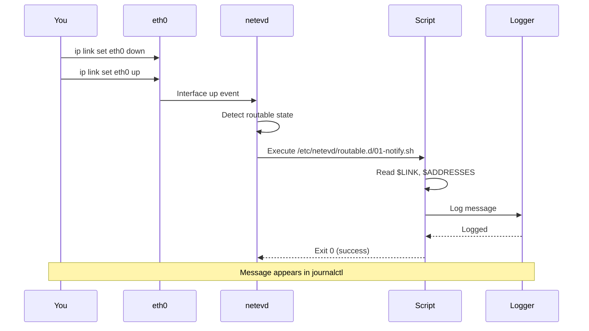

<!-- SPDX-License-Identifier: LGPL-3.0-or-later -->

# Quick Start Guide

Get netevd up and running in 5 minutes.

## What is netevd?

netevd is a network event daemon that watches your network interfaces and runs scripts when things change. Think of it as "cron for your network" - when your interface gets an IP address, loses its connection, or routes change, netevd automatically executes your custom scripts.


## 5-Minute Setup

### Step 1: Install (2 minutes)

**Option A: From Source (Recommended)**

```bash
# Install Rust (if not already installed)
curl --proto '=https' --tlsv1.2 -sSf https://sh.rustup.rs | sh
source $HOME/.cargo/env

# Clone and build
git clone https://github.com/ssahani/netevd.git
cd netevd
cargo build --release

# Install
sudo install -Dm755 target/release/netevd /usr/bin/netevd
sudo install -Dm644 systemd/netevd.service /lib/systemd/system/netevd.service
sudo install -Dm644 examples/netevd.yaml /etc/netevd/netevd.yaml
```

**Option B: From Package**

```bash
# Arch Linux
yay -S netevd

# Fedora/RHEL (download RPM from releases)
sudo dnf install netevd-*.rpm

# Debian/Ubuntu (download DEB from releases)
sudo dpkg -i netevd_*.deb
```

### Step 2: Create User & Directories (1 minute)

```bash
# Create netevd user
sudo useradd -r -M -s /usr/bin/nologin -d /nonexistent netevd

# Create script directories
sudo mkdir -p /etc/netevd/{carrier.d,no-carrier.d,routable.d,routes.d}
```

### Step 3: Create Your First Script (1 minute)

Let's create a simple script that logs when an interface becomes routable:

```bash
sudo tee /etc/netevd/routable.d/01-notify.sh > /dev/null << 'EOF'
#!/bin/bash
# This runs when an interface gets full network connectivity

echo "$(date): Interface $LINK is routable with IP $ADDRESSES" | \
    logger -t netevd

# You can add any commands here:
# - Send notifications
# - Update DNS
# - Start services
# - etc.
EOF

# Make it executable
sudo chmod +x /etc/netevd/routable.d/01-notify.sh
```

### Step 4: Start netevd (1 minute)

```bash
# Start and enable the service
sudo systemctl daemon-reload
sudo systemctl enable --now netevd

# Check it's running
sudo systemctl status netevd

# Watch the logs
sudo journalctl -u netevd -f
```

### Step 5: Test It!

Trigger a network event:

```bash
# Bring interface down and up
sudo ip link set eth0 down
sudo ip link set eth0 up

# Check the logs - you should see your script ran!
sudo journalctl -u netevd -n 20

# Check system log for our script's output
sudo journalctl -t netevd -n 10
```

You should see output like:
```
Jan 23 10:30:45 hostname netevd: Interface eth0 is routable with IP 192.168.1.100
```

**Congratulations!** 🎉 netevd is now running and executing your scripts on network events.

## What Just Happened?



## Next Steps

### Add More Functionality

**Example: Send Email When Link Goes Down**

```bash
sudo tee /etc/netevd/no-carrier.d/01-alert.sh > /dev/null << 'EOF'
#!/bin/bash
# Alert when cable is unplugged

echo "ALERT: Interface $LINK lost carrier at $(date)" | \
    mail -s "Network Alert: Link Down" admin@example.com

logger -t netevd "ALERT: $LINK is down"
EOF

sudo chmod +x /etc/netevd/no-carrier.d/01-alert.sh
```

**Example: Update Dynamic DNS**

```bash
sudo tee /etc/netevd/routable.d/02-update-dns.sh > /dev/null << 'EOF'
#!/bin/bash
# Update DuckDNS when IP changes

if [ "$LINK" = "eth0" ]; then
    IP=$(echo "$ADDRESSES" | awk '{print $1}')
    DOMAIN="yourdomain"
    TOKEN="your-token"

    curl -s "https://www.duckdns.org/update?domains=$DOMAIN&token=$TOKEN&ip=$IP"
    logger -t netevd "Updated DNS: $DOMAIN -> $IP"
fi
EOF

sudo chmod +x /etc/netevd/routable.d/02-update-dns.sh
```

### Configure for Your Backend

netevd supports three network manager backends. Choose the one you use:

**systemd-networkd (Default)**

Already configured! No changes needed.

**NetworkManager**

```bash
sudo nano /etc/netevd/netevd.yaml
```

Change:
```yaml
system:
  backend: "NetworkManager"  # Change from systemd-networkd
```

Then restart:
```bash
sudo systemctl restart netevd
```

**dhclient**

```bash
sudo nano /etc/netevd/netevd.yaml
```

Change:
```yaml
system:
  backend: "dhclient"
```

Then restart:
```bash
sudo systemctl restart netevd
```

### Monitor Specific Interfaces

By default, netevd monitors all interfaces. To monitor only specific ones:

```bash
sudo nano /etc/netevd/netevd.yaml
```

Add:
```yaml
monitoring:
  interfaces:
    - eth0
    - wlan0
```

Restart:
```bash
sudo systemctl restart netevd
```

## Common Use Cases

### 1. Multi-Interface Routing

If you have multiple network interfaces and need traffic to use the correct one:

```yaml
# /etc/netevd/netevd.yaml
routing:
  policy_rules:
    - eth1  # Enable automatic routing for eth1
```

See full example: [Multi-Homed Server](EXAMPLES.md#multi-homed-server)

### 2. VPN Integration

Automatically route specific networks through VPN when it connects:

See full example: [VPN Integration](EXAMPLES.md#vpn-integration)

### 3. High Availability

Automatic failover between network interfaces:

See full example: [High Availability Setup](EXAMPLES.md#high-availability-setup)

## Available Environment Variables

Your scripts receive these environment variables:

| Variable | Description | Example |
|----------|-------------|---------|
| `$LINK` | Interface name | `eth0` |
| `$LINKINDEX` | Interface index number | `2` |
| `$STATE` | Current state | `routable` |
| `$BACKEND` | Network manager | `systemd-networkd` |
| `$ADDRESSES` | IP addresses (space-separated) | `192.168.1.100 10.0.0.5` |
| `$JSON` | Full interface data (systemd-networkd) | `{"Index":2,"Name":"eth0",...}` |

**Example using variables:**

```bash
#!/bin/bash
echo "Interface: $LINK"
echo "Index: $LINKINDEX"
echo "State: $STATE"
echo "Backend: $BACKEND"
echo "IPs: $ADDRESSES"

# Extract first IP
FIRST_IP=$(echo "$ADDRESSES" | awk '{print $1}')
echo "Primary IP: $FIRST_IP"

# Parse JSON (requires jq)
if [ -n "$JSON" ]; then
    MTU=$(echo "$JSON" | jq -r '.MTU')
    echo "MTU: $MTU"
fi
```

## Script Directories

Scripts are organized by event type:

```
/etc/netevd/
├── carrier.d/          # Cable connected (link has carrier)
├── no-carrier.d/       # Cable disconnected (link lost carrier)
├── routable.d/         # Interface fully operational
├── configured.d/       # Interface configured (has IP)
├── degraded.d/         # Interface partially working
├── activated.d/        # NetworkManager: device activated
├── disconnected.d/     # NetworkManager: device disconnected
├── manager.d/          # Network manager state changes
└── routes.d/           # Routing table changes
```

**Script execution order:**
- Scripts run in alphabetical order
- Use numeric prefixes: `01-`, `02-`, `03-`
- Exit code 0 = success, non-zero = error (logged but doesn't stop other scripts)

## Debugging

### View Logs

```bash
# Follow logs in real-time
sudo journalctl -u netevd -f

# View recent logs
sudo journalctl -u netevd -n 50

# Search for script executions
sudo journalctl -u netevd | grep "Executing"

# View script output
sudo journalctl -t netevd  # From logger commands in scripts
```

### Enable Debug Logging

```bash
# Edit config
sudo nano /etc/netevd/netevd.yaml

# Change log level
system:
  log_level: "debug"  # or "trace" for even more detail

# Restart
sudo systemctl restart netevd

# Now logs will be much more verbose
sudo journalctl -u netevd -f
```

### Test Scripts Manually

```bash
# Run script with environment variables
sudo env \
    LINK=eth0 \
    LINKINDEX=2 \
    STATE=routable \
    BACKEND=systemd-networkd \
    ADDRESSES="192.168.1.100" \
    /etc/netevd/routable.d/01-notify.sh

# Test with bash debugging
sudo env LINK=eth0 STATE=routable \
    bash -x /etc/netevd/routable.d/01-notify.sh
```

### Common Issues

**Script not executing?**

```bash
# Check if executable
ls -la /etc/netevd/routable.d/

# Make executable
sudo chmod +x /etc/netevd/routable.d/*.sh

# Check shebang line
head -1 /etc/netevd/routable.d/01-notify.sh
# Should show: #!/bin/bash
```

**Service won't start?**

```bash
# Check status
sudo systemctl status netevd -l

# Check config syntax
yamllint /etc/netevd/netevd.yaml

# Check if user exists
id netevd
# If not: sudo useradd -r -M -s /usr/bin/nologin netevd
```

**No events received?**

```bash
# Check backend is running
sudo systemctl status systemd-networkd  # or NetworkManager

# Trigger manual event
sudo ip link set eth0 down
sudo ip link set eth0 up

# Check logs immediately
sudo journalctl -u netevd -n 20
```

## Where to Go from Here

**Basic Usage:**
- [Configuration Guide](../CONFIGURATION.md) - All configuration options
- [Examples](EXAMPLES.md) - Real-world scenarios

**Integration:**
- [REST API](API.md) - Automate via HTTP API
- [Prometheus Metrics](METRICS.md) - Monitor with Prometheus/Grafana

**Advanced:**
- [Architecture](ARCHITECTURE.md) - How netevd works internally
- [Troubleshooting](TROUBLESHOOTING.md) - Solve problems
- [Contributing](../CONTRIBUTING.md) - Contribute code

## Getting Help

- Documentation: [docs/README.md](README.md)
- Issues: https://github.com/ssahani/netevd/issues
- Discussions: https://github.com/ssahani/netevd/discussions

## Cheat Sheet

```bash
# Service management
sudo systemctl start netevd
sudo systemctl stop netevd
sudo systemctl restart netevd
sudo systemctl status netevd

# View logs
sudo journalctl -u netevd -f        # Follow logs
sudo journalctl -u netevd -n 50     # Last 50 lines
sudo journalctl -u netevd --since "1 hour ago"

# Configuration
sudo nano /etc/netevd/netevd.yaml   # Edit config
yamllint /etc/netevd/netevd.yaml    # Validate syntax
sudo systemctl restart netevd       # Apply changes

# Scripts
ls -la /etc/netevd/routable.d/      # List scripts
sudo chmod +x /etc/netevd/routable.d/*.sh  # Make executable
sudo nano /etc/netevd/routable.d/01-test.sh # Edit script

# Debugging
sudo env LINK=eth0 /etc/netevd/routable.d/01-test.sh  # Test script
netevd --version                    # Check version
ip link show                        # Show interfaces
ip addr show                        # Show IP addresses
ip route show                       # Show routes
```

Happy scripting! 🚀
