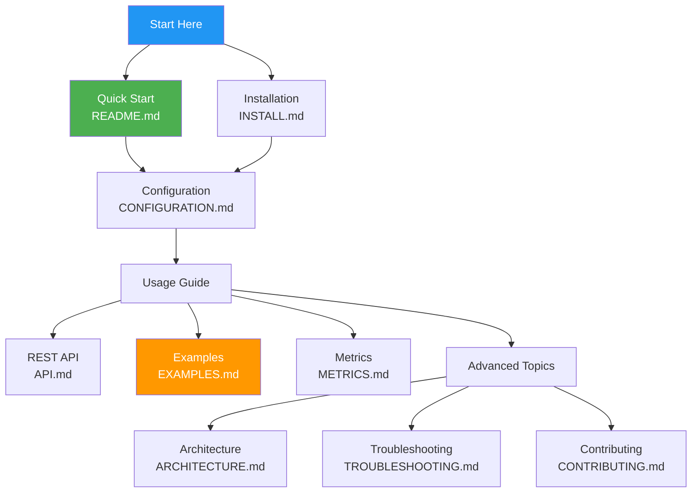
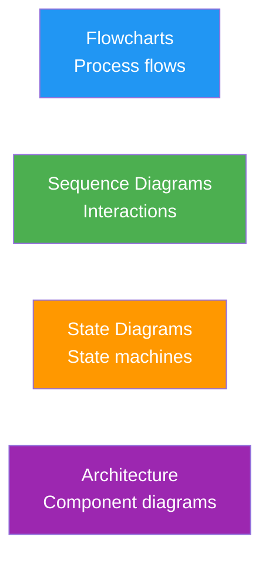

<!-- SPDX-License-Identifier: LGPL-3.0-or-later -->

# netevd Documentation

Welcome to the comprehensive documentation for netevd - the high-performance network event daemon.

## Documentation Structure



## Core Documentation

### Getting Started

| Document | Description | Audience |
|----------|-------------|----------|
| [README.md](../README.md) | Project overview, quick start, feature highlights | Everyone |
| [INSTALL.md](../INSTALL.md) | Installation instructions for various platforms | Administrators |
| [CONFIGURATION.md](../CONFIGURATION.md) | Complete configuration reference | Administrators |

### Usage Guides

| Document | Description | Audience |
|----------|-------------|----------|
| [EXAMPLES.md](EXAMPLES.md) | Real-world usage examples with diagrams | Administrators, DevOps |
| [API.md](API.md) | REST API reference and integration guide | Developers |
| [METRICS.md](METRICS.md) | Prometheus metrics documentation | DevOps, SRE |

### Advanced Topics

| Document | Description | Audience |
|----------|-------------|----------|
| [ARCHITECTURE.md](ARCHITECTURE.md) | Deep dive into system architecture | Developers, Contributors |
| [TROUBLESHOOTING.md](TROUBLESHOOTING.md) | Comprehensive problem-solving guide | Administrators, Support |
| [CONTRIBUTING.md](../CONTRIBUTING.md) | How to contribute to the project | Contributors |

### Reference

| Document | Description | Audience |
|----------|-------------|----------|
| [SECURITY.md](../SECURITY.md) | Security model and best practices | Security Engineers |
| [CHANGELOG.md](../CHANGELOG.md) | Version history and changes | Everyone |

## Quick Navigation

### By Use Case

**I want to...**

- **Get started quickly** → [README.md](../README.md) → [INSTALL.md](../INSTALL.md)
- **Configure multi-interface routing** → [EXAMPLES.md - Multi-Homed Server](EXAMPLES.md#multi-homed-server)
- **Integrate with VPN** → [EXAMPLES.md - VPN Integration](EXAMPLES.md#vpn-integration)
- **Set up high availability** → [EXAMPLES.md - High Availability](EXAMPLES.md#high-availability-setup)
- **Monitor with Prometheus** → [METRICS.md](METRICS.md)
- **Use the REST API** → [API.md](API.md)
- **Troubleshoot issues** → [TROUBLESHOOTING.md](TROUBLESHOOTING.md)
- **Understand the internals** → [ARCHITECTURE.md](ARCHITECTURE.md)
- **Contribute code** → [CONTRIBUTING.md](../CONTRIBUTING.md)

### By Role

**System Administrator:**
1. [INSTALL.md](../INSTALL.md) - Install netevd
2. [CONFIGURATION.md](../CONFIGURATION.md) - Configure for your environment
3. [EXAMPLES.md](EXAMPLES.md) - See real-world examples
4. [TROUBLESHOOTING.md](TROUBLESHOOTING.md) - Solve problems

**Developer:**
1. [README.md](../README.md) - Understand the project
2. [ARCHITECTURE.md](ARCHITECTURE.md) - Learn the internals
3. [CONTRIBUTING.md](../CONTRIBUTING.md) - Set up development environment
4. [API.md](API.md) - Integrate via REST API

**DevOps/SRE:**
1. [INSTALL.md](../INSTALL.md) - Automated deployment
2. [METRICS.md](METRICS.md) - Set up monitoring
3. [API.md](API.md) - Automation and integration
4. [EXAMPLES.md - Cloud Integration](EXAMPLES.md#cloud-monitoring-integration)

**Security Engineer:**
1. [SECURITY.md](../SECURITY.md) - Security model
2. [ARCHITECTURE.md - Security](ARCHITECTURE.md#security-architecture) - Implementation details
3. [CONFIGURATION.md](../CONFIGURATION.md) - Secure configuration

## Documentation Standards

### Diagram Types

We use Mermaid diagrams extensively throughout the documentation:



### Code Examples

All code examples are:
- **Tested** on real systems
- **Complete** (can be copied and used directly)
- **Commented** with inline explanations
- **Safe** (validated for security issues)

### Conventions

- **File paths** are shown as: `/etc/netevd/netevd.yaml`
- **Commands** are shown in code blocks with `bash` syntax highlighting
- **Configuration** examples use YAML format
- **Required** parameters are marked as (required)
- **Optional** parameters show default values

## Contributing to Documentation

We welcome documentation improvements!

### Quick Fixes

For typos or small corrections:
1. Click "Edit" on GitHub
2. Make your changes
3. Submit a pull request

### New Content

For new documentation:
1. Read [CONTRIBUTING.md](../CONTRIBUTING.md)
2. Follow the existing structure
3. Include diagrams where helpful
4. Provide working examples
5. Test all code snippets

### Diagram Guidelines

When adding Mermaid diagrams:
- Keep them simple and focused
- Use consistent styling (see existing diagrams)
- Add descriptive labels
- Use colors to highlight important elements

## Getting Help

### Documentation Issues

If documentation is unclear or incorrect:
- Open an issue: https://github.com/ssahani/netevd/issues
- Tag with `documentation` label
- Describe what's confusing
- Suggest improvements

### Technical Support

For technical problems:
1. Check [TROUBLESHOOTING.md](TROUBLESHOOTING.md)
2. Search existing issues
3. Collect diagnostic information
4. Open a new issue with details

### Community

- GitHub Issues: https://github.com/ssahani/netevd/issues
- Discussions: https://github.com/ssahani/netevd/discussions

## Document Versioning

Documentation is versioned with the code:
- `main` branch: Latest stable release
- `develop` branch: Upcoming features
- Release tags: Specific versions (e.g., `v0.2.0`)

## Offline Documentation

### Generate HTML

```bash
# Install dependencies
pip install mkdocs mkdocs-material

# Serve locally
mkdocs serve

# Build static site
mkdocs build
```

### Generate PDF

```bash
# Install pandoc
sudo apt-get install pandoc texlive

# Generate PDF
pandoc README.md \
    INSTALL.md \
    CONFIGURATION.md \
    docs/EXAMPLES.md \
    docs/API.md \
    docs/METRICS.md \
    docs/ARCHITECTURE.md \
    docs/TROUBLESHOOTING.md \
    CONTRIBUTING.md \
    -o netevd-documentation.pdf \
    --toc \
    --number-sections
```

## Documentation Roadmap

Upcoming documentation improvements:

- [ ] Video tutorials
- [ ] Interactive configuration generator
- [ ] More cloud provider examples (AWS, Azure, GCP)
- [ ] Kubernetes operator guide
- [ ] Performance tuning guide
- [ ] Migration guides from other tools
- [ ] FAQ section
- [ ] Glossary of terms

## License

All documentation is licensed under LGPL-3.0-or-later, same as the code.

```
Copyright 2026 Susant Sahani

This documentation is free software: you can redistribute it and/or modify
it under the terms of the GNU Lesser General Public License as published by
the Free Software Foundation, either version 3 of the License, or
(at your option) any later version.
```

## See Also

- [Project Website](https://github.com/ssahani/netevd)
- [Release Notes](../CHANGELOG.md)
- [License](../LICENSE)

---

**Last Updated:** 2026-01-23
**Documentation Version:** 0.2.0
