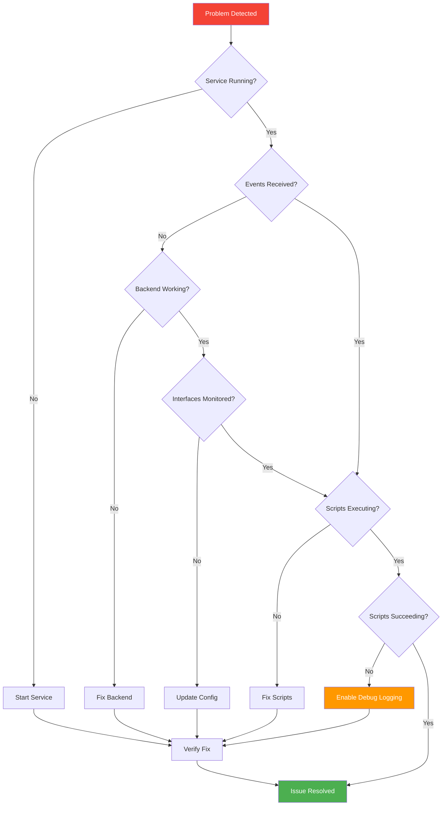
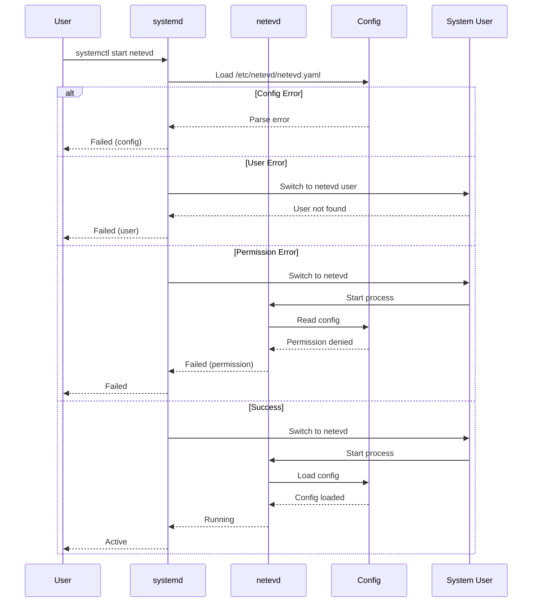
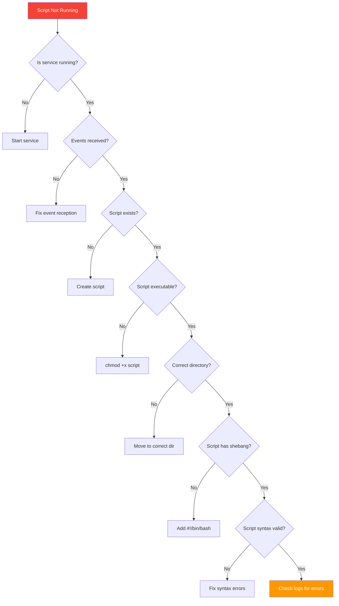

<!-- SPDX-License-Identifier: LGPL-3.0-or-later -->

# Troubleshooting Guide

Comprehensive troubleshooting guide for netevd issues.

## Table of Contents

- [Diagnostic Tools](#diagnostic-tools)
- [Common Issues](#common-issues)
- [Service Issues](#service-issues)
- [Script Execution Problems](#script-execution-problems)
- [Routing Issues](#routing-issues)
- [Backend-Specific Issues](#backend-specific-issues)
- [Performance Problems](#performance-problems)
- [Debug Mode](#debug-mode)

## Diagnostic Tools

### Diagnostic Flow



### Essential Commands

```bash
# Service status
sudo systemctl status netevd

# Real-time logs
sudo journalctl -u netevd -f

# Recent logs with full output
sudo journalctl -u netevd -n 100 --no-pager

# Logs for specific time range
sudo journalctl -u netevd --since "1 hour ago"

# Filter by priority
sudo journalctl -u netevd -p warning

# Configuration validation
netevd validate --config /etc/netevd/netevd.yaml

# Check network state
netevd status --format json | jq

# List monitored interfaces
netevd list interfaces

# Watch events live
netevd events --follow
```

## Common Issues

### Issue #1: Service Won't Start



**Symptoms:**
- `systemctl status netevd` shows "failed"
- Service immediately exits after start

**Diagnosis:**
```bash
# Check status
sudo systemctl status netevd -l

# View errors
sudo journalctl -u netevd -n 50 --no-pager

# Common error patterns
sudo journalctl -u netevd | grep -i error
```

**Solutions:**

**A. User doesn't exist:**
```bash
# Error: "User netevd could not be found"
sudo useradd -r -M -s /usr/bin/nologin -d /nonexistent netevd
sudo systemctl restart netevd
```

**B. Configuration error:**
```bash
# Error: "failed to parse configuration"

# Validate YAML syntax
yamllint /etc/netevd/netevd.yaml

# Or use Python
python3 -c "import yaml; yaml.safe_load(open('/etc/netevd/netevd.yaml'))"

# Check for common issues
grep -n "^\s*-\s*$" /etc/netevd/netevd.yaml  # Empty list items
grep -n "^\s*[a-z_]*:\s*$" /etc/netevd/netevd.yaml  # Empty values
```

**C. Permission issues:**
```bash
# Check file ownership
ls -la /etc/netevd/netevd.yaml

# Should be readable by netevd user
sudo chmod 644 /etc/netevd/netevd.yaml
sudo chown root:netevd /etc/netevd/netevd.yaml

# Check directory permissions
sudo chmod 755 /etc/netevd
```

**D. Missing capabilities:**
```bash
# Verify systemd service has capabilities
sudo systemctl cat netevd | grep -i capabilit

# Should see:
# AmbientCapabilities=CAP_NET_ADMIN

# Reload if modified
sudo systemctl daemon-reload
sudo systemctl restart netevd
```

---

### Issue #2: No Events Received

**Symptoms:**
- Service running but no events logged
- Scripts never execute
- `netevd events` shows nothing

**Diagnosis:**
```bash
# Check if events are being logged
sudo journalctl -u netevd | grep -i "event\|processing"

# Check backend connection
sudo journalctl -u netevd | grep -i "backend\|listener"

# Trigger manual event
sudo ip link set eth0 down
sudo ip link set eth0 up

# Check immediately after
sudo journalctl -u netevd -n 20
```

**Solutions by Backend:**

**systemd-networkd:**
```bash
# Verify systemd-networkd is running
sudo systemctl status systemd-networkd

# Check DBus connection
busctl tree org.freedesktop.network1

# Trigger networkd event
sudo networkctl reload

# Check netevd logs
sudo journalctl -u netevd | tail -20
```

**NetworkManager:**
```bash
# Verify NetworkManager is running
sudo systemctl status NetworkManager

# Check DBus connection
busctl tree org.freedesktop.NetworkManager

# Trigger NM event
sudo nmcli device disconnect eth0
sudo nmcli device connect eth0
```

**dhclient:**
```bash
# Verify dhclient is running
ps aux | grep dhclient

# Check lease file exists
ls -la /var/lib/dhcp/dhclient.leases

# Trigger lease renewal
sudo dhclient -r eth0
sudo dhclient eth0
```

**Interface not monitored:**
```bash
# Check config
grep -A10 "^monitoring:" /etc/netevd/netevd.yaml

# Should list your interface or be empty (monitor all)
# If specific interfaces listed, add yours:
sudo nano /etc/netevd/netevd.yaml
# monitoring:
#   interfaces:
#     - eth0  # Add your interface

sudo systemctl restart netevd
```

---

### Issue #3: Scripts Not Executing



**Diagnosis:**
```bash
# Check if scripts are in correct directory
ls -la /etc/netevd/routable.d/

# Check for execution attempts in logs
sudo journalctl -u netevd | grep -i "executing\|script"

# Manual script test
sudo env \
  LINK=eth0 \
  LINKINDEX=2 \
  STATE=routable \
  BACKEND=systemd-networkd \
  ADDRESSES="192.168.1.100" \
  /etc/netevd/routable.d/01-test.sh
```

**Solutions:**

**A. Script not executable:**
```bash
# Check permissions
ls -la /etc/netevd/routable.d/01-test.sh

# Should show: -rwxr-xr-x
# If not:
sudo chmod +x /etc/netevd/routable.d/01-test.sh
```

**B. Wrong directory:**
```bash
# Scripts must be in event-specific directories
/etc/netevd/
├── carrier.d/          # Link up
├── no-carrier.d/       # Link down
├── routable.d/         # Routable state
├── configured.d/       # Configured state
└── routes.d/           # Route changes

# Move script to correct directory
sudo mv /etc/netevd/01-test.sh /etc/netevd/routable.d/
```

**C. Missing shebang:**
```bash
# Script must start with shebang
head -1 /etc/netevd/routable.d/01-test.sh

# Should show: #!/bin/bash
# If not, add it:
#!/bin/bash
# Rest of script...
```

**D. Script errors:**
```bash
# Test script syntax
bash -n /etc/netevd/routable.d/01-test.sh

# Run with error trace
bash -x /etc/netevd/routable.d/01-test.sh

# Check script logs
sudo journalctl -u netevd | grep "01-test.sh"
```

---

### Issue #4: Routing Rules Not Created

**Symptoms:**
- `ip rule list` doesn't show expected rules
- Multi-interface routing not working
- Traffic not using correct interface

**Diagnosis:**
```bash
# Check current rules
ip rule list

# Check custom routing tables
ip route show table 203  # Adjust table number

# Check config
grep -A5 "^routing:" /etc/netevd/netevd.yaml

# Check logs for routing operations
sudo journalctl -u netevd | grep -i "routing\|rule\|table"
```

**Solutions:**

**A. Interface not configured for routing:**
```yaml
# /etc/netevd/netevd.yaml must include interface
routing:
  policy_rules:
    - eth1  # Add your interface

# Then restart
sudo systemctl restart netevd
```

**B. Interface not routable:**
```bash
# Rules only created when interface is routable
# Check interface state
ip addr show eth1

# Should have IP address and be UP
# If not, configure network:

# For systemd-networkd
sudo networkctl reload

# For NetworkManager
sudo nmcli device connect eth1
```

**C. Insufficient permissions:**
```bash
# Verify CAP_NET_ADMIN capability
sudo systemctl show netevd | grep Capabilit

# Should include CAP_NET_ADMIN
# If not, check service file:
sudo systemctl cat netevd | grep AmbientCapabilities
```

**D. Manual cleanup needed:**
```bash
# Remove old rules (if interface index changed)
sudo ip rule del from 192.168.1.100 table 203
sudo ip rule del to 192.168.1.100 table 203
sudo ip route del table 203

# Restart netevd to recreate
sudo systemctl restart netevd

# Verify
ip rule list
ip route show table 203
```

---

## Service Issues

### Service Keeps Restarting

**Diagnosis:**
```bash
# Check restart count
systemctl show netevd | grep NRestarts

# View crash logs
sudo journalctl -u netevd | grep -i "panic\|fatal\|crash"

# Check for resource limits
systemctl show netevd | grep -i limit
```

**Solutions:**
```bash
# Increase restart limits
sudo systemctl edit netevd

# Add:
[Service]
StartLimitIntervalSec=300
StartLimitBurst=5

# Check for memory leaks
ps aux | grep netevd

# If memory growing, report bug with:
sudo journalctl -u netevd -n 1000 > netevd-crash.log
```

### High CPU Usage

**Diagnosis:**
```bash
# Check CPU usage
top -p $(pgrep netevd)

# Profile with perf
sudo perf record -p $(pgrep netevd) -g -- sleep 10
sudo perf report
```

**Possible Causes:**
1. Event storm (many rapid network changes)
2. Slow scripts blocking event loop
3. Bug in netlink processing

**Solutions:**
```bash
# Check event rate
netevd events --tail 100

# Identify slow scripts
sudo journalctl -u netevd | grep "Script.*took"

# Optimize or remove slow scripts
```

### High Memory Usage

**Diagnosis:**
```bash
# Check memory
ps aux | grep netevd | awk '{print $6}'

# Trend over time
while true; do
  ps aux | grep netevd | awk '{print $6}'
  sleep 60
done > memory-usage.log
```

**Solutions:**
```bash
# Set memory limit
sudo systemctl edit netevd

# Add:
[Service]
MemoryMax=100M
MemoryHigh=80M

sudo systemctl daemon-reload
sudo systemctl restart netevd
```

## Script Execution Problems

### Script Timeout

**Symptoms:**
- Scripts killed before completion
- Logs show "timeout"

**Default timeout:** 30 seconds

**Solutions:**
```bash
# Make scripts faster:
# - Use background jobs for long operations
# - Split into multiple scripts
# - Optimize commands

# Example: Background job
#!/bin/bash
(
  # Long operation
  sleep 60
  echo "Done"
) &  # Run in background

exit 0  # Script returns immediately
```

### Environment Variables Not Available

**Diagnosis:**
```bash
# Test script with env vars
sudo env \
  LINK=eth0 \
  LINKINDEX=2 \
  STATE=routable \
  ADDRESSES="192.168.1.100" \
  bash -x /etc/netevd/routable.d/01-test.sh
```

**Available Variables:**
- `$LINK` - Interface name
- `$LINKINDEX` - Interface index
- `$STATE` - Current state
- `$BACKEND` - Backend name
- `$ADDRESSES` - IP addresses (space-separated)
- `$JSON` - Full JSON (systemd-networkd only)

### Script Fails Silently

**Enable logging in scripts:**
```bash
#!/bin/bash
# Enable error logging
exec 2>&1  # Redirect stderr to stdout
set -euo pipefail  # Exit on error

# Log to syslog
logger -t netevd-script "Starting script for $LINK"

# Your script logic
echo "Interface: $LINK"
echo "State: $STATE"

# Log completion
logger -t netevd-script "Script completed for $LINK"
```

**Check script output:**
```bash
sudo journalctl -t netevd-script
```

## Routing Issues

### Traffic Using Wrong Interface

**Diagnostic Flow:**
```bash
# 1. Check routing rules exist
ip rule list | grep -A2 "from.*192.168.1.100"

# 2. Check custom routing table
ip route show table 203

# 3. Test routing decision
ip route get 8.8.8.8 from 192.168.1.100

# Should show: ... dev eth1 table 203

# 4. Trace packet path
sudo tcpdump -i eth1 -n host 192.168.1.100
```

**Solutions:**
```bash
# Force route lookup
ip route flush cache

# Recreate rules
sudo systemctl restart netevd

# Verify with
curl --interface eth1 https://ifconfig.me
```

### Gateway Not Reachable

**Diagnosis:**
```bash
# Check interface has gateway
ip route | grep default

# Test gateway reachability
ping -c 3 -I eth1 192.168.1.1

# Check ARP
ip neigh show dev eth1
```

**Solutions:**
```bash
# Verify network configuration
sudo networkctl status eth1

# Or for NetworkManager
nmcli device show eth1
```

## Backend-Specific Issues

### systemd-networkd Issues

**DBus connection failed:**
```bash
# Test DBus connection
busctl call org.freedesktop.network1 \
  /org/freedesktop/network1 \
  org.freedesktop.network1.Manager \
  ListLinks

# Check systemd-networkd status
sudo systemctl status systemd-networkd

# Restart if needed
sudo systemctl restart systemd-networkd
```

**State files missing:**
```bash
# Check state files
ls -la /run/systemd/netif/links/

# Should have files for each interface
# If missing, restart systemd-networkd
sudo systemctl restart systemd-networkd
```

### NetworkManager Issues

**Device not managed:**
```bash
# Check device management
nmcli device status

# If unmanaged, edit:
sudo nano /etc/NetworkManager/NetworkManager.conf

# Remove from [keyfile] unmanaged-devices or
# Set managed=true
```

**DBus permission denied:**
```bash
# Check netevd user can access DBus
sudo -u netevd busctl tree org.freedesktop.NetworkManager

# If fails, check DBus policy:
ls -la /etc/dbus-1/system.d/
```

### dhclient Issues

**Lease file not found:**
```bash
# Find lease file location
sudo find /var -name "dhclient*.leases" 2>/dev/null

# Update config if needed
# /etc/netevd/netevd.yaml
backends:
  dhclient:
    lease_file: "/var/lib/dhcp/dhclient.eth0.leases"
```

**File watcher not triggering:**
```bash
# Test file watcher
# Modify lease file:
sudo touch /var/lib/dhcp/dhclient.leases

# Check logs immediately
sudo journalctl -u netevd -n 10
```

## Performance Problems

### Slow Event Processing

**Diagnosis:**
```bash
# Enable metrics
# Then check event latency
curl http://localhost:9090/metrics | grep event_duration
```

**Solutions:**
1. Optimize scripts (remove slow commands)
2. Reduce script count
3. Use event filters (if available)
4. Profile netevd binary

### Event Storm

**Symptoms:**
- Thousands of events per second
- High CPU usage
- System unresponsive

**Diagnosis:**
```bash
# Check event rate
netevd events --tail 100 | wc -l

# Check logs
sudo journalctl -u netevd --since "1 minute ago" | wc -l
```

**Solutions:**
```bash
# Identify source
sudo journalctl -u netevd --since "1 minute ago" | grep "event" | head -50

# If caused by interface flapping:
# - Check physical connection
# - Check driver issues
# - Consider blacklisting interface

# Temporary: Stop service
sudo systemctl stop netevd
# Fix underlying issue
# Then restart
sudo systemctl start netevd
```

## Debug Mode

### Enable Debug Logging

**Method 1: Configuration**
```yaml
# /etc/netevd/netevd.yaml
system:
  log_level: "debug"  # or "trace" for even more detail
```

```bash
sudo systemctl restart netevd
```

**Method 2: Environment Variable**
```bash
sudo systemctl edit netevd

# Add:
[Service]
Environment="RUST_LOG=debug"

sudo systemctl daemon-reload
sudo systemctl restart netevd
```

**Method 3: Temporary (one-time)**
```bash
sudo RUST_LOG=trace /usr/bin/netevd --foreground
```

### Trace Specific Modules

```bash
# Only network module
RUST_LOG=netevd::network=trace

# Multiple modules
RUST_LOG=netevd::network=trace,netevd::listeners=debug

# Everything except one module
RUST_LOG=trace,netevd::metrics=info
```

### Capture Debug Output

```bash
# Save to file
sudo journalctl -u netevd -n 1000 > debug.log

# Follow and save
sudo journalctl -u netevd -f | tee debug.log

# With timestamps
sudo journalctl -u netevd -o short-iso -f
```

## Getting Help

### Information to Collect

```bash
#!/bin/bash
# debug-netevd.sh - Collect diagnostic information

echo "=== System Information ==="
uname -a
cat /etc/os-release

echo -e "\n=== netevd Version ==="
netevd --version

echo -e "\n=== Service Status ==="
systemctl status netevd --no-pager

echo -e "\n=== Configuration ==="
cat /etc/netevd/netevd.yaml

echo -e "\n=== Recent Logs ==="
journalctl -u netevd -n 100 --no-pager

echo -e "\n=== Network State ==="
ip link show
ip addr show
ip route show
ip rule list

echo -e "\n=== Script Directories ==="
ls -laR /etc/netevd/*.d/

echo -e "\n=== Backend Status ==="
systemctl status systemd-networkd NetworkManager --no-pager

echo -e "\n=== Processes ==="
ps aux | grep -E "netevd|networkd|NetworkManager|dhclient"
```

Run and attach output:
```bash
sudo bash debug-netevd.sh > debug-report.txt 2>&1
```

### Reporting Issues

Include in bug report:
1. Debug report (above)
2. Steps to reproduce
3. Expected vs. actual behavior
4. netevd version
5. OS and kernel version

Submit to: https://github.com/ssahani/netevd/issues

## See Also

- [CONFIGURATION.md](../CONFIGURATION.md) - Configuration reference
- [README.md](../README.md) - General documentation
- [ARCHITECTURE.md](ARCHITECTURE.md) - System internals
